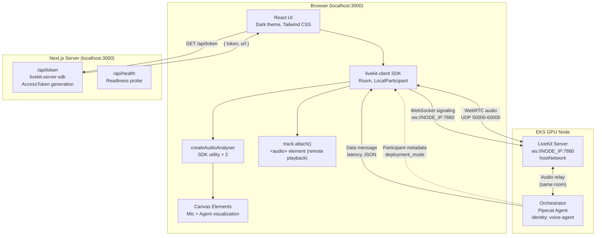
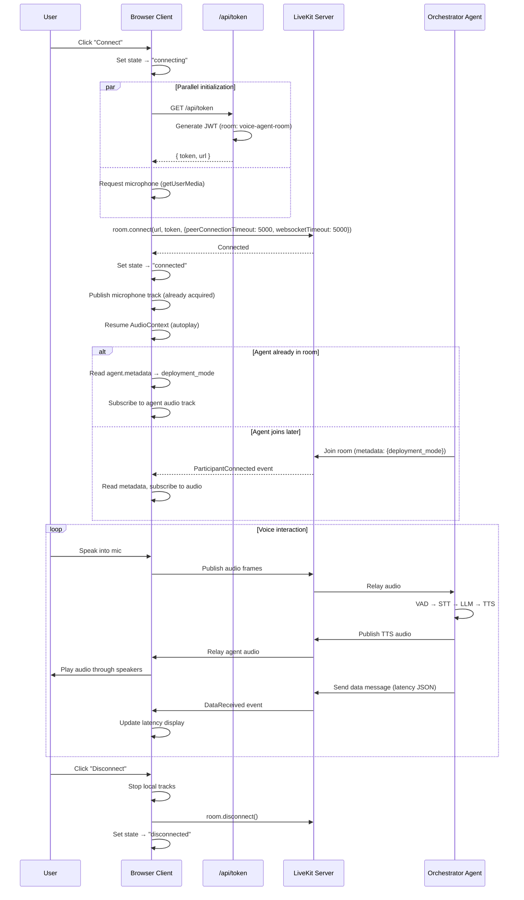
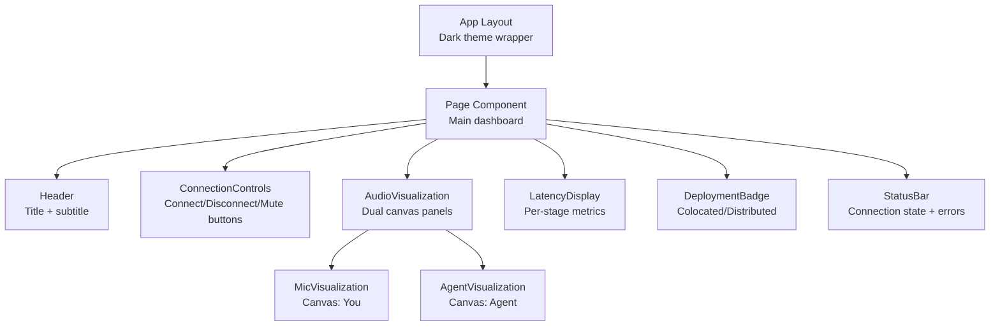
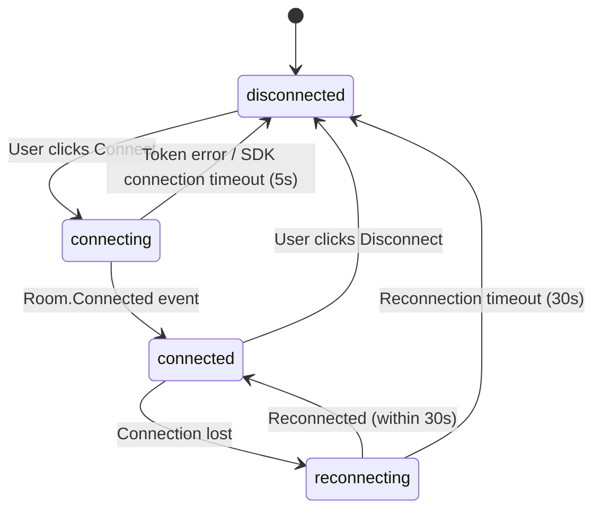
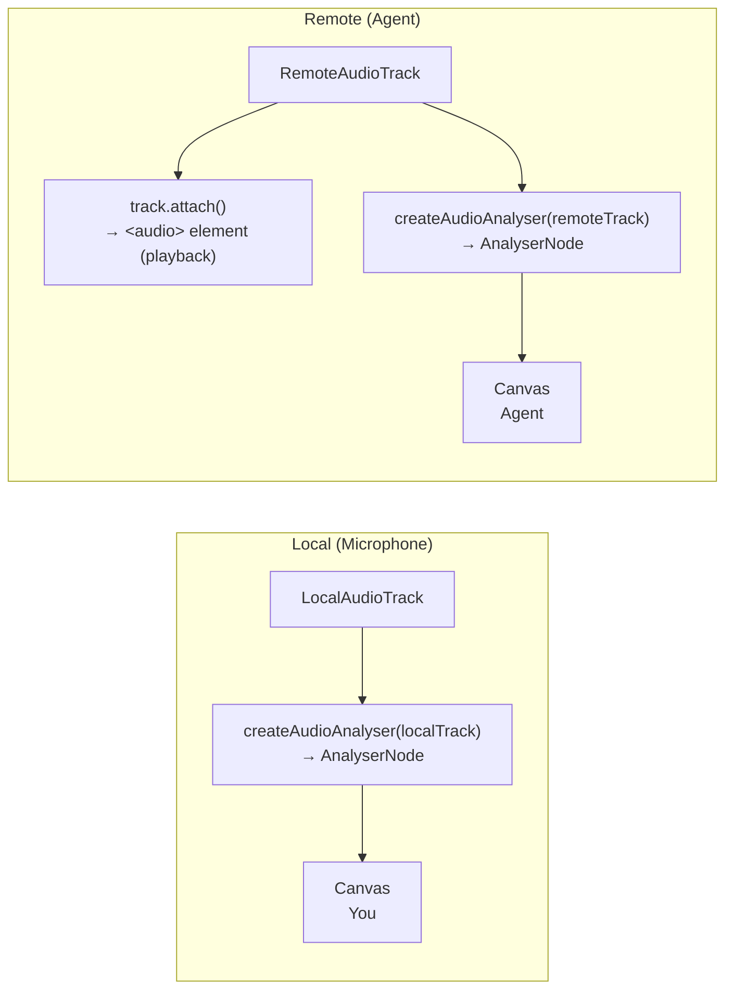

# Design Document: Browser Voice Client

## Overview

The Browser Voice Client is a Next.js web application that provides a real-time voice interface for interacting with the colocated voice AI pipeline on EKS. It connects to a LiveKit room via WebRTC using the `livekit-client` SDK, captures microphone audio, plays back AI-generated speech, and displays per-stage latency metrics and deployment mode information.

The application is designed as a single-page dashboard optimized for blog post screenshots — dark theme, minimal UI, clear data hierarchy. It runs on `localhost:3000` where the browser provides a secure context for `getUserMedia`, and connects to LiveKit Server at `ws://<NODE_IP>:7880` (no TLS required for the demo setup).

### Key Design Decisions

1. **Next.js App Router with server-side token generation** — The `/api/token` route generates LiveKit JWTs server-side, keeping API secrets out of the browser. The client is a single-page app with no server-side rendering needs for the main UI.
2. **`livekit-client` SDK (not `@livekit/components-react`)** — Direct SDK usage gives full control over connection lifecycle, audio track management, and data message handling without component library overhead.
3. **SDK `createAudioAnalyser` for visualization** — Uses the `livekit-client` SDK's built-in `createAudioAnalyser()` utility to create Web Audio AnalyserNodes attached to tracks, providing frequency data for canvas rendering and a `calculateVolume()` convenience method without manual Web Audio graph wiring.
4. **Participant metadata for deployment mode** — The orchestrator sets `deployment_mode` in its participant metadata when joining the LiveKit room. The client reads this from the `ParticipantConnected` or existing participant's metadata — no additional API calls needed.
5. **Server-provided LiveKit URL (no `NEXT_PUBLIC_*`)** — The LiveKit URL is returned by `/api/token` at runtime, avoiding the Next.js limitation where `NEXT_PUBLIC_*` variables are inlined at build time and cannot be overridden in Docker containers. API key/secret remain server-side only.
6. **`output: 'standalone'` for Docker** — Next.js standalone mode produces a minimal self-contained build (~150MB) that runs with `node server.js` without the full `node_modules` tree.
7. **Parallel mic acquisition** — Microphone access is requested in parallel with the token fetch to reduce time-to-first-audio by 200-500ms.
8. **SDK-native connection timeouts** — Uses `livekit-client`'s built-in `peerConnectionTimeout` and `websocketTimeout` options (set to 5s) instead of external `Promise.race` wrappers, avoiding zombie connection states.

### Network Assumptions

This design assumes direct network access from the browser to the EKS node IP (UDP 50000-60000 for WebRTC media, TCP 7880 for WebSocket signaling). No TURN server is configured. If users run from behind restrictive NATs or corporate firewalls, WebRTC will fail. For non-demo deployments, add ICE/TURN configuration via `rtcConfig` in `room.connect()` options.

## Architecture



### Connection Sequence



## Components and Interfaces

### Component Hierarchy



### Component Specifications

| Component | Responsibility | Key Props/State |
|-----------|---------------|-----------------|
| `VoiceClient` (page) | Top-level state management, LiveKit room lifecycle | `connectionState`, `room`, `error` |
| `ConnectionControls` | Connect/disconnect/mute buttons | `state`, `isMuted`, `onConnect`, `onDisconnect`, `onToggleMute` |
| `AudioVisualization` | Dual canvas rendering using SDK's `createAudioAnalyser` | `localTrack`, `remoteTrack`, `isActive` |
| `LatencyDisplay` | Per-stage latency breakdown with total highlight | `latencyData` |
| `DeploymentBadge` | Shows deployment mode from agent metadata | `mode: 'colocated' | 'distributed' | 'unknown'` |
| `StatusBar` | Connection state, errors, waiting messages | `state`, `error`, `agentPresent` |

### Hook Architecture

| Hook | Purpose |
|------|---------|
| `useRoom` | Manages LiveKit Room instance lifecycle, connection with SDK timeout options, and event subscriptions |
| `useAudioVisualization` | Wraps SDK `createAudioAnalyser()`, drives requestAnimationFrame loop for canvas rendering |
| `useLatencyData` | Parses `DataReceived` events, validates latency JSON schema |
| `useDeploymentMode` | Reads participant metadata on join/metadata-change events |

### LiveKit SDK Integration

The client uses these `livekit-client` SDK events:

| Event | Handler |
|-------|---------|
| `RoomEvent.Connected` | Update state to "connected" |
| `RoomEvent.Disconnected` | Update state to "disconnected", cleanup |
| `RoomEvent.Reconnecting` | Update state to "reconnecting" |
| `RoomEvent.Reconnected` | Update state to "connected" |
| `RoomEvent.TrackSubscribed` | Attach remote audio track via `track.attach()` for playback, create analyser via `createAudioAnalyser()` for visualization |
| `RoomEvent.TrackUnsubscribed` | Detach remote audio element, call analyser `cleanup()`, stop visualization |
| `RoomEvent.DataReceived` | Parse latency JSON, update display |
| `RoomEvent.ParticipantConnected` | Read metadata for deployment_mode |
| `RoomEvent.ParticipantMetadataChanged` | Update deployment_mode if changed |
| `RoomEvent.ParticipantDisconnected` | Show "agent disconnected" status |
| `RoomEvent.MediaDevicesError` | Handle mic permission denied / device lost |

## Data Models

### Token Response (`/api/token` → Client)

```typescript
// GET /api/token response
interface TokenResponse {
  token: string;  // Signed JWT string
  url: string;    // LiveKit WebSocket URL (e.g., "ws://1.2.3.4:7880")
}

// Error response (500 or 405)
interface TokenError {
  error: string;  // Human-readable error message
}
```

### Latency Data Message (Agent → Client via LiveKit data channel)

```typescript
// JSON payload sent by orchestrator agent as a LiveKit data message
interface LatencyMessage {
  type: "latency";        // Message discriminator
  vad_ms: number;         // VAD processing duration in milliseconds
  stt_ms: number;         // Speech-to-text duration in milliseconds
  llm_ms: number;         // LLM inference duration in milliseconds (time to first token)
  tts_ms: number;         // Text-to-speech duration in milliseconds
  total_ms: number;       // End-to-end latency in milliseconds
}

// Client-side parsed representation
interface LatencyData {
  vad: number | null;     // null = not yet received
  stt: number | null;
  llm: number | null;
  tts: number | null;
  total: number | null;
}
```

### Connection State Machine



```typescript
type ConnectionState = 'disconnected' | 'connecting' | 'connected' | 'reconnecting';

interface ConnectionStatus {
  state: ConnectionState;
  error: string | null;        // Error message for display
  agentPresent: boolean;       // Whether voice-agent participant is in room
}
```

### Participant Metadata (Orchestrator Agent)

```typescript
// JSON metadata set by orchestrator when joining the LiveKit room
// Accessed via: participant.metadata (string, JSON-encoded)
interface AgentMetadata {
  deployment_mode: "colocated" | "distributed";
}
```

### Environment Variables

| Variable | Side | Required | Description |
|----------|------|----------|-------------|
| `LIVEKIT_URL` | Server only | Yes | LiveKit WebSocket URL (e.g., `ws://1.2.3.4:7880`). Returned to the client in `/api/token` response |
| `LIVEKIT_API_KEY` | Server only | Yes | LiveKit API key for token generation |
| `LIVEKIT_API_SECRET` | Server only | Yes | LiveKit API secret for token generation |
| `PORT` | Server only | No | HTTP listen port (default: 3000) |

**Note:** No `NEXT_PUBLIC_*` variables are used. The LiveKit URL is provided to the client at runtime via the `/api/token` response, making the Docker image fully reusable across environments without rebuilds.

## API Route Design

### `GET /api/token`

**Purpose:** Generate a LiveKit access token for the browser client to join the room.

**Implementation:**

```typescript
import { AccessToken } from 'livekit-server-sdk';
import { NextResponse } from 'next/server';

export async function GET() {
  const apiKey = process.env.LIVEKIT_API_KEY;
  const apiSecret = process.env.LIVEKIT_API_SECRET;
  const livekitUrl = process.env.LIVEKIT_URL;

  if (!apiKey || !apiSecret || !livekitUrl) {
    return NextResponse.json(
      { error: 'Server misconfiguration: missing LiveKit environment variables' },
      { status: 500 }
    );
  }

  const participantIdentity = `user-${crypto.randomUUID().slice(0, 8)}`;

  const token = new AccessToken(apiKey, apiSecret, {
    identity: participantIdentity,
    ttl: '6h',
  });

  token.addGrant({
    roomJoin: true,
    room: 'voice-agent-room',
    canPublish: true,
    canSubscribe: true,
    canPublishData: false,
  });

  const jwt = await token.toJwt();

  return NextResponse.json({ token: jwt, url: livekitUrl });
}
```

**Grant permissions:**
- `roomJoin: true` — Can join the room
- `room: 'voice-agent-room'` — Restricted to this specific room
- `canPublish: true` — Can publish audio tracks
- `canSubscribe: true` — Can subscribe to remote audio + data messages
- `canPublishData: false` — Client doesn't need to send data messages (receiving is governed by `canSubscribe`)

**Room connection options:**

```typescript
await room.connect(url, token, {
  peerConnectionTimeout: 5000,  // 5s timeout (SDK default is 15s)
  websocketTimeout: 5000,       // 5s timeout (SDK default is 15s)
  autoSubscribe: true,          // Auto-subscribe to remote tracks
});
```

Using the SDK's built-in timeout options avoids the need for external `Promise.race` wrappers that can leave zombie connections if the SDK's internal connection completes after the external timer fires.

**Known limitation:** The room name `voice-agent-room` is hardcoded. Concurrent sessions would collide. For multi-session support, make the room name configurable via env var or generate unique room names.

### `GET /api/health`

**Purpose:** Kubernetes readiness/liveness probe endpoint.

```typescript
export async function GET() {
  const apiKey = process.env.LIVEKIT_API_KEY;
  const apiSecret = process.env.LIVEKIT_API_SECRET;
  const livekitUrl = process.env.LIVEKIT_URL;

  if (!apiKey || !apiSecret || !livekitUrl) {
    return NextResponse.json({ status: 'unhealthy', reason: 'missing env vars' }, { status: 503 });
  }

  return NextResponse.json({ status: 'ok' });
}
```

## Audio Visualization Approach

### Using SDK's `createAudioAnalyser`

The `livekit-client` SDK (v2.21+) provides a [`createAudioAnalyser(track, options?)`](https://docs.livekit.io/reference/client-sdk-js/functions/createAudioAnalyser.html) utility that creates a Web Audio AnalyserNode attached to a given track. This handles AudioContext creation and lifecycle internally, returning:
- `analyser: AnalyserNode` — standard Web Audio node for frequency/time-domain data
- `calculateVolume(): number` — convenience method returning volume in 0-1 range
- `cleanup(): Promise<void>` — closes the AudioContext when done

### Audio Pipeline



**Critical: Remote audio playback** — The remote track must be attached to an `<audio>` element via `track.attach()` for actual speaker output. The `createAudioAnalyser` only provides visualization data — it does not route audio to the speakers. These are independent paths: `track.attach()` handles playback while `createAudioAnalyser()` provides the AnalyserNode for canvas rendering.

### Implementation Details

1. **Analyser creation** — Called inside the `TrackSubscribed` handler (which fires after the user's connect gesture), satisfying browser autoplay policies. Each track gets its own analyser instance.

2. **AnalyserNode usage for rendering:**
   - Access the returned `analyser` node with `analyser.fftSize = 256` (128 frequency bins)
   - `smoothingTimeConstant: 0.7` for smooth transitions
   - `minDecibels: -90`, `maxDecibels: -10` tuned for voice
   - Focus rendering on the first 30-40 bins (voice-relevant frequencies: 85-4000Hz at 48kHz sample rate) for responsive visualization

3. **Rendering loop** — `requestAnimationFrame` drives a 60fps loop. Each frame:
   - Calls `analyser.getByteFrequencyData(dataArray)` to get frequency-domain values (0-255)
   - Renders vertical bars on the canvas, focusing on voice-range bins
   - Uses gradient colors: green (low amplitude) → cyan (high amplitude) on dark background

4. **Canvas sizing:** Minimum 200×80px per requirement. Actual rendering at 300×100px with `devicePixelRatio` scaling for sharp rendering on HiDPI displays.

5. **Zero-amplitude state:** When muted or no audio, the dataArray contains all zeros → bars render at baseline height (1px) providing a flat-line visual.

6. **Cleanup:** When disconnecting, call `cleanup()` on each analyser instance (closes the AudioContext), detach `<audio>` elements via `track.detach()`, and cancel the animation frame loop.

### Audio Codec Configuration

The microphone track is published with explicit Opus settings optimized for voice:

```typescript
await room.localParticipant.publishTrack(micTrack, {
  dtx: true,           // Discontinuous Transmission — reduces bandwidth during silence
  red: true,           // Redundant encoding — improves resilience to packet loss
  audioBitrate: 32000, // 32kbps Opus is sufficient for voice
});
```

**DTX** is enabled by default in the LiveKit JS SDK for mono audio tracks, but we set it explicitly for clarity. DTX reduces bandwidth when the user isn't speaking and provides the orchestrator's VAD with cleaner silence periods.

## Deployment Mode Detection

The orchestrator agent sets its participant metadata when joining the LiveKit room. The client detects the deployment mode through two paths:

1. **Agent already in room when client connects:** After `room.connect()` resolves, iterate `room.remoteParticipants` to find the participant with identity `voice-agent`, parse its `metadata` JSON.

2. **Agent joins after client:** Listen for `RoomEvent.ParticipantConnected`, check if the new participant's identity is `voice-agent`, parse metadata.

3. **Metadata changes:** Listen for `RoomEvent.ParticipantMetadataChanged` in case the orchestrator updates its metadata after joining (unlikely but defensive).

**Metadata parsing logic:**

```typescript
function parseDeploymentMode(metadata: string | undefined): 'colocated' | 'distributed' | 'unknown' {
  if (!metadata) return 'unknown';
  try {
    const parsed = JSON.parse(metadata);
    if (parsed.deployment_mode === 'colocated' || parsed.deployment_mode === 'distributed') {
      return parsed.deployment_mode;
    }
    return 'unknown';
  } catch {
    return 'unknown';
  }
}
```

**Orchestrator-side requirement:** The orchestrator's `livekit_token.py` must be updated to include metadata in the token, and the Helm configmap must pass a `DEPLOYMENT_MODE` environment variable derived from `scheduling.colocated`. This is a dependency on the orchestrator spec.

## Dockerfile Multi-Stage Build Design

```dockerfile
# Stage 1: Dependencies
FROM node:20-alpine AS deps
WORKDIR /app
COPY package.json package-lock.json ./
RUN npm ci --only=production

# Stage 2: Build
FROM node:20-alpine AS builder
WORKDIR /app
COPY package.json package-lock.json ./
RUN npm ci
COPY . .
RUN npm run build

# Stage 3: Production runtime
FROM node:20-alpine AS runner
WORKDIR /app
ENV NODE_ENV=production
ENV PORT=3000

# Non-root user for security
RUN addgroup --system --gid 1001 nodejs
RUN adduser --system --uid 1001 nextjs

# Copy standalone build output
COPY --from=builder /app/public ./public
COPY --from=builder --chown=nextjs:nodejs /app/.next/standalone ./
COPY --from=builder --chown=nextjs:nodejs /app/.next/static ./.next/static

USER nextjs
EXPOSE 3000

CMD ["node", "server.js"]
```

**Key design choices:**
- **Alpine base** — Minimal image size (~150-200MB compressed)
- **`output: 'standalone'`** in `next.config.js` — Produces self-contained server with only required `node_modules`
- **Non-root user** — Runs as `nextjs:nodejs` (UID 1001) per security best practice
- **Runtime env vars** — `LIVEKIT_URL`, `LIVEKIT_API_KEY`, `LIVEKIT_API_SECRET` are read at request time by the API routes, not baked into the build. No `NEXT_PUBLIC_*` variables are used, so the same image works across environments without rebuilds.

**Size budget:** Target < 200MB compressed (well within the 500MB requirement).

## Correctness Properties

*A property is a characteristic or behavior that should hold true across all valid executions of a system — essentially, a formal statement about what the system should do. Properties serve as the bridge between human-readable specifications and machine-verifiable correctness guarantees.*

### Property 1: Connection state machine transitions are valid

*For any* sequence of LiveKit room events (Connected, Disconnected, Reconnecting, Reconnected) and user actions (connect, disconnect), the connection state SHALL only transition through valid paths in the state machine: disconnected→connecting→connected, connected→reconnecting→connected, connected→disconnected, reconnecting→disconnected, connecting→disconnected. No other transitions are permitted.

**Validates: Requirements 1.2, 1.3, 1.5, 1.6, 1.7**

### Property 2: Latency message parsing preserves valid data and rejects malformed input

*For any* JSON string received as a LiveKit data message, if it has `type: "latency"` and all numeric stage fields (vad_ms, stt_ms, llm_ms, tts_ms, total_ms), the parsed LatencyData SHALL contain the exact integer-rounded millisecond values; if any required field is missing, non-numeric, or the JSON is unparseable, the previously displayed LatencyData values SHALL remain unchanged.

**Validates: Requirements 4.1, 4.2, 4.6**

### Property 3: Deployment mode parsing returns correct value or "unknown"

*For any* participant metadata string, if it is valid JSON containing a `deployment_mode` field with value "colocated" or "distributed", the `parseDeploymentMode` function SHALL return that exact value. For any metadata that is undefined, empty, unparseable JSON, or contains a `deployment_mode` value other than "colocated" or "distributed", it SHALL return "unknown".

**Validates: Requirements 5.2, 5.3, 5.4**

### Property 4: Token endpoint produces valid JWT with correct grants

*For any* set of valid environment variables (LIVEKIT_API_KEY non-empty, LIVEKIT_API_SECRET non-empty, LIVEKIT_URL non-empty), the `/api/token` endpoint SHALL return HTTP 200 with a JWT that, when decoded, contains a unique participant identity, grants for room "voice-agent-room" with canPublish=true and canSubscribe=true, canPublishData=false, and a TTL of 6 hours.

**Validates: Requirements 8.1, 8.2, 8.3**

### Property 5: Missing environment variables produce error responses

*For any* subset of the three required environment variables (LIVEKIT_API_KEY, LIVEKIT_API_SECRET, LIVEKIT_URL) where at least one is missing or empty, both the `/api/token` endpoint SHALL return HTTP 500 with an error message and the `/api/health` endpoint SHALL return a non-200 response.

**Validates: Requirements 8.4, 10.8**

### Property 6: Parallel mic acquisition completes before or with connection

*For any* successful connection attempt, the microphone MediaStream SHALL be acquired in parallel with the token fetch such that it is available for publishing immediately after `room.connect()` resolves, without requiring an additional sequential `getUserMedia` call post-connection.

**Validates: Requirements 2.1, 1.1 (time constraint)**

## Error Handling

| Scenario | Detection | User Feedback | Recovery |
|----------|-----------|---------------|----------|
| Token request fails (network/500) | `fetch` rejects or non-200 status | Error toast: "Could not obtain token" | Return to disconnected, user retries |
| Connection timeout (5s) | SDK `peerConnectionTimeout` / `websocketTimeout` set to 5000ms | Error toast: "Connection timed out" | Return to disconnected, user retries |
| Mic permission denied | `RoomEvent.MediaDevicesError` | Error toast: "Microphone access required" | Disconnect from room, return to disconnected |
| Mic device lost mid-session | `track.on('ended')` event | Warning toast: "Microphone disconnected" | Stop publishing, keep room connected |
| LiveKit connection lost | `RoomEvent.Reconnecting` | Status: "Reconnecting..." | SDK auto-reconnects for 30s, then disconnect |
| Agent not present | No remote participant after 2s | Status: "Waiting for agent..." | Keep polling `remoteParticipants` |
| Malformed latency data | JSON parse fails or missing fields | Silently discard, keep previous values | No action needed |
| Browser unsupported | `navigator.mediaDevices` undefined | Error message with supported browsers | Block connection attempt |
| Invalid LiveKit URL | WebSocket connection error | Error toast: "Cannot reach LiveKit server" | Return to disconnected |

## Testing Strategy

### Assessment: Property-Based Testing Is Applicable

The browser voice client contains several pure functions and data transformation logic suitable for PBT:
- Token generation (JWT encoding with variable inputs)
- Latency message parsing and validation
- Deployment mode extraction from metadata
- Connection state machine transitions

### Property-Based Testing Library

**Library:** [fast-check](https://github.com/dubzzz/fast-check) (TypeScript property-based testing)
**Runner:** Vitest
**Configuration:** Minimum 100 iterations per property test

Each property test MUST be tagged with a comment referencing the design property:
```typescript
// Feature: browser-voice-client, Property 1: Connection state machine transitions are valid
```

### Property Test Implementation Plan

| Property | Function Under Test | Generator Strategy |
|----------|--------------------|--------------------|
| 1 (State machine) | `connectionReducer(state, event)` | Generate random sequences of valid events (Connected, Disconnected, Reconnecting, Reconnected, UserConnect, UserDisconnect) and verify all resulting states are valid transitions |
| 2 (Latency parsing) | `parseLatencyMessage(json)` | Generate arbitrary JSON strings: valid latency objects, partial objects, non-JSON, wrong types. Verify correct parse or preservation of previous state |
| 3 (Deployment mode) | `parseDeploymentMode(metadata)` | Generate: valid metadata JSON with correct values, invalid JSON, undefined, wrong field values. Verify correct output |
| 4 (Token generation) | `/api/token` handler | Generate random API key/secret/URL strings (non-empty), call handler, decode JWT, verify grants |
| 5 (Missing env vars) | `/api/token` + `/api/health` handlers | Generate all possible subsets of {key, secret, url} where at least one is empty/missing, verify error responses |

### Unit Tests (Example-Based)

| Area | Test Cases |
|------|------------|
| `/api/token` | Returns 405 for POST; unique participant identity per request |
| `/api/health` | Returns 200 when healthy; returns 503 when env vars missing |
| Mute/unmute | Toggle mutes/unmutes local audio track |
| Mic permission denied | Disconnects from room with error |
| Agent disconnect | Shows status message |
| Audio visualization | Canvas elements have minimum dimensions; zero amplitude when muted |
| No latency data | Displays dash "—" for each stage |

### Integration Tests

| Area | What's Verified |
|------|-----------------|
| LiveKit connection | WebSocket connection to a test LiveKit server |
| Audio publish | Mic track published after connection |
| Data message flow | Latency JSON parsed from DataReceived event |
| Metadata read | Deployment mode extracted from participant metadata |

### End-to-End Tests

Run manually against a deployed cluster:
1. Connect browser client → verify "connected" state
2. Speak → verify agent audio playback
3. Verify latency display updates after each interaction
4. Verify deployment mode badge shows correct value
5. Disconnect → verify clean state reset

### Docker Image Validation

```bash
# Build and verify size
docker build -t browser-voice-client .
docker image inspect browser-voice-client --format '{{.Size}}' | awk '{print $1/1048576 " MB"}'
# Should be < 500MB

# Verify startup time
time docker run -e LIVEKIT_URL=ws://localhost:7880 \
  -e LIVEKIT_API_KEY=testkey -e LIVEKIT_API_SECRET=testsecret \
  -p 3000:3000 browser-voice-client &
curl --retry 10 --retry-delay 1 http://localhost:3000/api/health
# Should respond within 10 seconds

# Verify non-root
docker exec <container> whoami
# Should output: nextjs

# Verify same image works with different LiveKit URL (no rebuild needed)
docker run -e LIVEKIT_URL=ws://192.168.1.100:7880 \
  -e LIVEKIT_API_KEY=prodkey -e LIVEKIT_API_SECRET=prodsecret \
  -p 3000:3000 browser-voice-client
```
