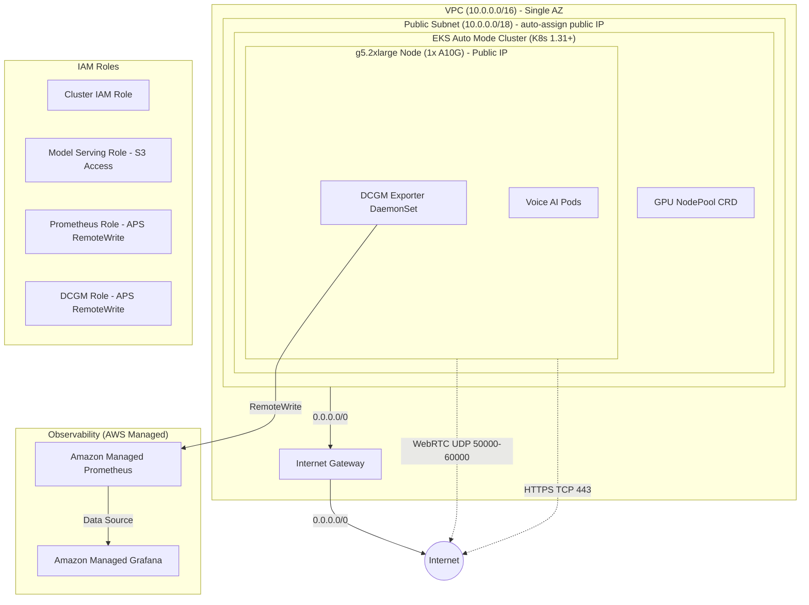
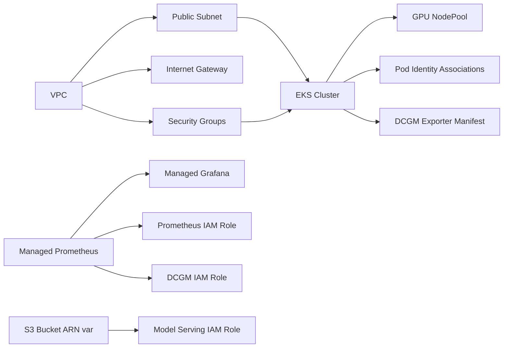

# Design Document

## Overview

This design provisions a production-ready Amazon EKS Auto Mode cluster optimized for colocated voice AI workloads (LiveKit media server + GPU-accelerated LLM inference) on a single g5.2xlarge node. The infrastructure is defined entirely in Terraform using the official `terraform-aws-modules` ecosystem and targets a single Availability Zone to guarantee pod colocation. Nodes are launched in a public subnet with auto-assigned public IPs, enabling direct WebRTC ICE candidate advertisement for LiveKit without NAT or TURN overhead.

The design prioritizes simplicity and fast provisioning (<20 minutes) for a demo/blog-post context while maintaining security (restricted security groups, least-privilege IAM), observability (managed Prometheus/Grafana), and operational best practices.

### Key Design Decisions

1. **Single AZ:** All resources in one Availability Zone eliminates cross-AZ latency and removes the need for pod affinity rules. Voice AI pipelines require sub-millisecond inter-pod communication.
2. **Public Subnet Only (no NAT Gateway):** Nodes receive auto-assigned public IPs for direct WebRTC ICE candidate advertisement (LiveKit requires publicly routable IPs for media transport). EKS Auto Mode supports launching nodes in public subnets per [AWS documentation](https://docs.aws.amazon.com/eks/latest/userguide/auto-networking.html). This eliminates NAT Gateway cost (~$32/month + data processing fees) and reduces networking complexity for this demo architecture.
3. **EKS Auto Mode:** Delegates GPU driver management, device plugins, and load balancer provisioning to AWS. No manual DaemonSet installations for NVIDIA drivers.
4. **NodePool CRD (not Managed Node Groups):** EKS Auto Mode uses Karpenter-based NodePool custom resources. The GPU NodePool is applied as a Kubernetes manifest post-cluster creation.
5. **Pod Identity over IRSA:** EKS Pod Identity (the successor to IRSA) provides simpler, more secure workload identity without requiring OIDC provider configuration in each IAM trust policy.
6. **Terraform-native resources for observability:** Amazon Managed Prometheus and Grafana are provisioned via Terraform AWS provider resources, not Helm charts, for declarative lifecycle management.

---

## Architecture



### Resource Dependency Graph



---

## Components and Interfaces

### Terraform File Structure

```
terraform/
├── main.tf                   # All resources (VPC, EKS, NodePool, IAM, SGs, observability, DCGM)
├── variables.tf              # Input variables
├── outputs.tf                # Terraform outputs
└── terraform.tfvars.example  # Example variable values
```

The `main.tf` file is organized with section comments for readability:

```hcl
# --- Provider & Locals ---
# --- VPC & Networking ---
# --- EKS Auto Mode Cluster ---
# --- GPU NodePool (Kubernetes Manifest) ---
# --- Security Groups ---
# --- IAM Roles & Pod Identity ---
# --- Amazon Managed Prometheus ---
# --- Amazon Managed Grafana ---
# --- DCGM Exporter (Kubernetes Manifest) ---
```

This consolidated approach keeps the project simple for blog readers — one file to read top-to-bottom, easy to paste into a tutorial, and straightforward to `terraform apply`.

### Module Dependencies (Terraform Providers)

| Provider | Version | Purpose |
|----------|---------|---------|
| `hashicorp/aws` | `~> 5.0` | AWS resource provisioning |
| `hashicorp/kubernetes` | `~> 2.35` | NodePool CRD + DCGM DaemonSet manifests |
| `hashicorp/helm` | `~> 2.17` | Reserved for future Helm-based deployments |
| `terraform-aws-modules/vpc/aws` | `~> 5.0` | VPC with single-AZ subnets |
| `terraform-aws-modules/eks/aws` | `~> 20.0` | EKS Auto Mode cluster |

### Component Interfaces

#### VPC & Networking

- **Input:** Region, AZ selection, CIDR block (`10.0.0.0/16`)
- **Output:** VPC ID, public subnet ID
- Uses `terraform-aws-modules/vpc/aws` with a single public subnet, `map_public_ip_on_launch = true`
- No NAT Gateway — nodes use public IPs for outbound and inbound traffic via Internet Gateway
- Tags subnets with `kubernetes.io/role/elb = 1` for EKS load balancer discovery

#### EKS Auto Mode Cluster

- **Input:** VPC ID, public subnet IDs, cluster name, K8s version
- **Output:** Cluster endpoint, cluster certificate, OIDC provider ARN
- Configures `cluster_compute_config` with `enabled = true` for Auto Mode
- Enables Pod Identity Agent add-on
- Sets API endpoint to public-and-private

#### GPU NodePool

- **Input:** EKS cluster endpoint (depends on cluster creation)
- **Output:** None (Kubernetes resource)
- Applied via `kubernetes_manifest` resource
- Karpenter `NodePool` CRD with g5.2xlarge/g5.4xlarge constraints

#### Security Groups

- **Input:** VPC ID
- **Output:** Security group ID (attached to EKS cluster)
- WebRTC UDP 50000-60000 ingress from 0.0.0.0/0 and ::/0
- HTTPS TCP 443 ingress from 0.0.0.0/0 and ::/0
- Self-referencing rule for intra-cluster communication
- All egress allowed

#### IAM Roles & Pod Identity

- **Input:** Cluster name, namespace/SA names, S3 bucket ARN, Prometheus workspace ARN
- **Output:** Role ARNs
- Three workload roles: model-serving, prometheus, dcgm-exporter
- Pod Identity associations scoped to specific namespace/service account pairs

#### Amazon Managed Prometheus

- **Input:** Workspace alias
- **Output:** Workspace ID, endpoint URL, ARN

#### Amazon Managed Grafana

- **Input:** Prometheus workspace endpoint + ARN
- **Output:** Grafana workspace URL
- Explicit `depends_on` on Prometheus workspace
- Configures Prometheus as data source via `aws_grafana_workspace_configuration`

#### DCGM Exporter

- **Input:** Cluster endpoint, DCGM IAM role ARN
- **Output:** None (Kubernetes resource)
- DaemonSet targeting GPU nodes via `nvidia.com/gpu` toleration + node selector

---

## Data Models

### Terraform Variables

```hcl
variable "cluster_name" {
  description = "Name of the EKS cluster"
  type        = string
  default     = "voiceai-eks"
}

variable "aws_region" {
  description = "AWS region for all resources"
  type        = string
  default     = "us-east-1"
}

variable "availability_zone" {
  description = "Single AZ for all resources (must have g5 capacity)"
  type        = string
  default     = "us-east-1a"
}

variable "kubernetes_version" {
  description = "EKS Kubernetes version (must be >= 1.31)"
  type        = string
  default     = "1.31"
}

variable "vpc_cidr" {
  description = "CIDR block for the VPC"
  type        = string
  default     = "10.0.0.0/16"
}

variable "model_bucket_arn" {
  description = "ARN of the S3 bucket containing model weights"
  type        = string
}

variable "grafana_admin_groups" {
  description = "IAM Identity Center group IDs for Grafana admin access"
  type        = list(string)
  default     = []
}
```

### GPU NodePool CRD Manifest

```yaml
apiVersion: karpenter.sh/v1
kind: NodePool
metadata:
  name: gpu-voiceai
spec:
  disruption:
    budgets:
      - nodes: "0"
    consolidateAfter: 30m
    consolidationPolicy: WhenEmpty
  limits:
    nvidia.com/gpu: "2"
  template:
    metadata:
      labels:
        workload-type: gpu-voiceai
    spec:
      nodeClassRef:
        group: eks.amazonaws.com
        kind: NodeClass
        name: default
      requirements:
        - key: "karpenter.sh/capacity-type"
          operator: In
          values: ["on-demand"]
        - key: "kubernetes.io/arch"
          operator: In
          values: ["amd64"]
        - key: "node.kubernetes.io/instance-type"
          operator: In
          values: ["g5.2xlarge", "g5.4xlarge"]
        - key: "topology.kubernetes.io/zone"
          operator: In
          values: ["us-east-1a"]  # Templated from var.availability_zone
      taints:
        - key: nvidia.com/gpu
          value: "true"
          effect: NoSchedule
```

### DCGM Exporter DaemonSet Manifest

```yaml
apiVersion: apps/v1
kind: DaemonSet
metadata:
  name: dcgm-exporter
  namespace: monitoring
  labels:
    app: dcgm-exporter
spec:
  selector:
    matchLabels:
      app: dcgm-exporter
  template:
    metadata:
      labels:
        app: dcgm-exporter
    spec:
      serviceAccountName: dcgm-exporter
      tolerations:
        - key: nvidia.com/gpu
          operator: Exists
          effect: NoSchedule
      nodeSelector:
        eks.amazonaws.com/compute-type: auto
      containers:
        - name: dcgm-exporter
          image: nvcr.io/nvidia/k8s/dcgm-exporter:3.3.8-3.6.0-ubuntu22.04
          ports:
            - name: metrics
              containerPort: 9400
              protocol: TCP
          env:
            - name: DCGM_EXPORTER_KUBERNETES
              value: "true"
            - name: DCGM_EXPORTER_LISTEN
              value: ":9400"
            - name: DCGM_EXPORTER_INTERVAL
              value: "30000"
          readinessProbe:
            httpGet:
              path: /health
              port: 9400
            initialDelaySeconds: 30
            periodSeconds: 10
          resources:
            requests:
              cpu: 100m
              memory: 128Mi
            limits:
              cpu: 200m
              memory: 256Mi
          securityContext:
            privileged: true
          volumeMounts:
            - name: device-run
              mountPath: /var/lib/kubelet/device-plugins
      volumes:
        - name: device-run
          hostPath:
            path: /var/lib/kubelet/device-plugins
```

### IAM Policy Documents

**Model Serving Policy:**
```json
{
  "Version": "2012-10-17",
  "Statement": [
    {
      "Effect": "Allow",
      "Action": ["s3:GetObject", "s3:ListBucket"],
      "Resource": [
        "${var.model_bucket_arn}",
        "${var.model_bucket_arn}/*"
      ]
    }
  ]
}
```

**Prometheus RemoteWrite Policy:**
```json
{
  "Version": "2012-10-17",
  "Statement": [
    {
      "Effect": "Allow",
      "Action": "aps:RemoteWrite",
      "Resource": "${aws_prometheus_workspace.main.arn}"
    }
  ]
}
```

**Grafana Read Policy:**
```json
{
  "Version": "2012-10-17",
  "Statement": [
    {
      "Effect": "Allow",
      "Action": [
        "aps:QueryMetrics",
        "aps:GetMetricMetadata",
        "aps:GetSeries",
        "aps:GetLabels"
      ],
      "Resource": "${aws_prometheus_workspace.main.arn}"
    }
  ]
}
```

---

## Correctness Properties

This section is intentionally omitted. Property-based testing is not applicable to this feature because it is an Infrastructure as Code (Terraform) project. Terraform configurations are declarative — they describe desired state rather than implementing functions with variable inputs and outputs. There are no pure functions, parsers, serializers, or algorithmic logic where universal properties like round-trips or invariants would apply.

Correctness for this infrastructure is verified through:
- Terraform plan validation (expected resource count and configuration)
- Static security analysis (tfsec/checkov for IAM, security group, and encryption policy compliance)
- Post-apply integration tests (cluster reachable, GPU node provisions, metrics flowing)

See the Testing Strategy section for the complete verification approach.

---

## Error Handling

### Terraform Apply Failures

| Failure Scenario | Detection | Recovery |
|------------------|-----------|----------|
| g5 capacity unavailable in AZ | `InsufficientInstanceCapacity` error | Retry in different AZ or request quota increase |
| IAM role creation limit | `LimitExceeded` on `aws_iam_role` | Check account IAM role quota |
| EKS cluster creation timeout | Terraform timeout (default 30m) | Check CloudTrail for root cause |
| Grafana data source config fails | Terraform error on `aws_grafana_workspace_configuration` | Verify Prometheus workspace is ready (depends_on enforced) |
| Service quota insufficient for g5 | NodePool never provisions node | Verify "Running On-Demand G and VT instances" quota ≥ 8 vCPUs |

### Runtime Failures (Post-Provisioning)

| Failure Scenario | Detection | Impact |
|------------------|-----------|--------|
| GPU node fails health check | Karpenter drains and replaces node | Brief workload interruption |
| DCGM cannot reach GPU driver | Readiness probe fails, Kubernetes event emitted | Metrics gap until node replacement |
| Prometheus remote-write failure | Pod logs show 4xx/5xx from APS endpoint | Metrics gap; check IAM role trust |
| Grafana loses Prometheus connection | Dashboard queries return empty | Verify Prometheus workspace health |

### Terraform State Safety

- Remote state backend (S3 + DynamoDB) is recommended but not enforced in the module (left to user configuration)
- `prevent_destroy` lifecycle rule on EKS cluster to avoid accidental deletion
- Terraform plan always precedes apply in documentation

---

## Testing Strategy

### Why Property-Based Testing Does Not Apply

This project is Infrastructure as Code (Terraform). PBT is not appropriate because:
- Terraform is declarative configuration, not a function with inputs/outputs
- There are no pure functions with variable input spaces to test
- Infrastructure correctness is verified through plan validation and integration tests

### Recommended Testing Approach

#### 1. Terraform Validation Tests

- `terraform validate` — syntax and internal consistency
- `terraform plan` — verify resource count and no unexpected changes
- `tflint` — linting rules for AWS best practices

#### 2. Static Analysis

- `checkov` or `tfsec` — security scanning for:
  - No wildcard IAM policies
  - Security groups don't allow 0.0.0.0/0 on all ports
  - Encryption at rest enabled where applicable
  - Public subnet nodes have appropriate security group restrictions (WebRTC/HTTPS only)

#### 3. Integration Tests (Post-Apply)

| Test | Verification Command | Validates |
|------|---------------------|-----------|
| Cluster reachable | `aws eks describe-cluster --name $CLUSTER` | Req 2.1 |
| kubectl works | `kubectl get nodes` | Req 9.2 |
| GPU node provisions | `kubectl get nodes -l node.kubernetes.io/instance-type=g5.2xlarge` | Req 3.4 |
| DCGM metrics flowing | `kubectl exec dcgm-exporter -- wget -qO- localhost:9400/metrics` | Req 8.2 |
| Prometheus endpoint | `curl $AMP_ENDPOINT/api/v1/status/config` | Req 6.2 |
| Grafana accessible | `curl -I $GRAFANA_URL` | Req 7.3 |
| Security group rules | `aws ec2 describe-security-groups --group-ids $SG_ID` | Req 5.1-5.5 |

#### 4. Terraform Output Validation

- All outputs are non-empty strings after successful apply
- `update_kubeconfig_command` output is executable without modification
- Grafana URL is a valid HTTPS endpoint
- Prometheus endpoint matches the expected format

#### 5. Provisioning Time Test

- CI pipeline measures wall-clock time from `terraform apply` start to completion
- Assert < 20 minutes (excluding GPU node provisioning which happens on first pod schedule)

---

## Production Considerations

This architecture uses public subnets with direct node IP exposure for simplicity in a demo context. For production deployments, the following changes are recommended:

- **Private subnets with NAT Gateway:** Move EKS nodes to private subnets to avoid exposing node IPs directly to the internet.
- **STUNner as a TURN gateway:** Use [STUNner](https://github.com/l7mp/stunner) — a Kubernetes-native WebRTC media gateway — to relay WebRTC traffic into private nodes. STUNner integrates with EKS security groups and Kubernetes network policies, providing a secure media ingress path without public node IPs.
- **Network Policies:** Apply Kubernetes NetworkPolicy resources (or Calico/Cilium policies) to restrict pod-to-pod traffic to only expected flows.
- **VPC Flow Logs:** Enable VPC Flow Logs for network audit and anomaly detection.

This layered approach (private subnet + STUNner TURN + network policies) provides defense-in-depth while preserving low-latency WebRTC media transport.

---
