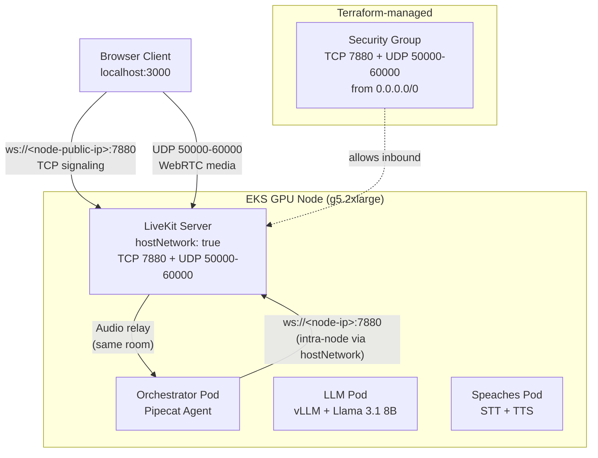
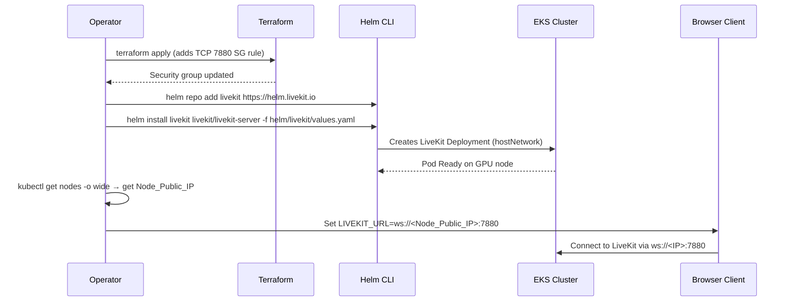

# Design Document: LiveKit Server Deployment

## Overview

This design covers the deployment of LiveKit Server on EKS as the WebRTC media server for the voice AI demo. The deployment uses the [official LiveKit Helm chart](https://github.com/livekit/livekit-helm) with a custom `values.yaml` file that configures hostNetwork mode, pod colocation with the voice pipeline, and direct node IP access for browser clients.

The approach is deliberately minimal — no ALB, no custom domain, no TLS certificate. The browser client runs on `localhost` (which provides a secure context for `getUserMedia`) and connects to LiveKit via `ws://<node-public-ip>:7880`.

### Key Design Decisions

1. **Direct node IP over ALB/domain** — Eliminates DNS, certificate provisioning, and load balancer setup. Acceptable for a single-node demo where the browser operator knows the node IP.
2. **hostNetwork: true** — Required by LiveKit for binding UDP media ports directly on the node. Limits deployment to one LiveKit pod per node, which is fine for a single-replica demo.
3. **No Redis** — Single-node LiveKit doesn't require Redis for room state coordination. Redis is only needed for multi-node deployments.
4. **preferredDuringScheduling affinity** — Soft preference to colocate with the LLM pod. Falls back gracefully if the GPU node is full.
5. **Placeholder credentials with CHANGE-ME prefix** — Makes it obvious that credentials must be replaced before deployment, while keeping the values file self-documenting.

## Architecture



> **Note on hostNetwork port exposure:** LiveKit binds UDP ports 50000-60000 directly on the node's network namespace via `hostNetwork: true`. These are **not** Kubernetes `hostPort` mappings — they are process-level binds visible because the pod shares the node's network stack. The security group rules allow external traffic to reach these ports.

### Deployment Flow



## Components and Interfaces

### 1. Helm Values File (`helm/livekit/values.yaml`)

Custom values override for the official LiveKit Helm chart. This is the primary deliverable — it configures:

| Setting | Value | Purpose |
|---------|-------|---------|
| `replicaCount` | 1 | Single-node demo |
| `podHostNetwork` | true | Bind ports on node interface (chart auto-sets `dnsPolicy: ClusterFirstWithHostNet`) |
| `livekit.port` | 7880 | Signaling WebSocket port |
| `livekit.rtc.port_range_start` | 50000 | WebRTC media UDP start |
| `livekit.rtc.port_range_end` | 60000 | WebRTC media UDP end |
| `livekit.rtc.use_external_ip` | true | Advertise node public IP to clients |
| `livekit.keys` | CHANGE-ME placeholder | API credentials |
| `loadBalancer.type` | disable | No Service/Ingress created (controls both) |
| `livekit.turn.enabled` | false | No TURN server for demo |
| `terminationGracePeriodSeconds` | 18000 | 5-hour graceful shutdown |
| `tolerations` | nvidia.com/gpu (operator: Equal, value: "true", effect: NoSchedule) | Schedule on GPU node — must match Karpenter NodePool taint exactly |
| `affinity` | prefer llm pod node | Colocation with pipeline |
| `resources.requests` | 500m CPU, 256Mi mem | Fit within g5.2xlarge headroom |

### 2. Terraform Security Group Addition (`terraform/main.tf`)

A new `aws_vpc_security_group_ingress_rule` resource for TCP 7880:

```hcl
# Ingress: TCP 7880 from 0.0.0.0/0 (LiveKit WebSocket signaling IPv4)
resource "aws_vpc_security_group_ingress_rule" "livekit_signaling_ipv4" {
  security_group_id = aws_security_group.node.id
  description       = "LiveKit WebSocket signaling (IPv4)"
  ip_protocol       = "tcp"
  from_port         = 7880
  to_port           = 7880
  cidr_ipv4         = "0.0.0.0/0"
  tags              = local.common_tags
}

# Ingress: TCP 7880 from ::/0 (LiveKit WebSocket signaling IPv6)
resource "aws_vpc_security_group_ingress_rule" "livekit_signaling_ipv6" {
  security_group_id = aws_security_group.node.id
  description       = "LiveKit WebSocket signaling (IPv6)"
  ip_protocol       = "tcp"
  from_port         = 7880
  to_port           = 7880
  cidr_ipv6         = "::/0"
  tags              = local.common_tags
}
```

This complements the existing UDP 50000-60000 rules already present in `main.tf`.

### 3. Voice-Pipeline ConfigMap Integration

The existing `helm/voice-pipeline/templates/configmap.yaml` already supports LiveKit credentials via `orchestrator.livekit.*` values. When deploying the voice-pipeline chart, the operator passes the same API key/secret used in the LiveKit values:

```bash
helm install voice-pipeline ./helm/voice-pipeline \
  --set orchestrator.livekit.url="ws://<NODE_PUBLIC_IP>:7880" \
  --set orchestrator.livekit.apiKey="<same-key-as-livekit>" \
  --set orchestrator.livekit.apiSecret="<same-secret-as-livekit>"
```

No template changes required — the ConfigMap already emits `LIVEKIT_URL`, `LIVEKIT_API_KEY`, and `LIVEKIT_API_SECRET` when these values are non-empty.

### 4. Browser Client URL Discovery

The browser client needs the LiveKit URL (`ws://<node-public-ip>:7880`). Discovery method:

```bash
# Get the public IP of the GPU node where LiveKit is running
NODE_IP=$(kubectl get nodes -o jsonpath='{.items[0].status.addresses[?(@.type=="ExternalIP")].address}')
echo "LIVEKIT_URL=ws://${NODE_IP}:7880"
```

The operator sets this as an environment variable when running the Next.js client locally:

```bash
NEXT_PUBLIC_LIVEKIT_URL=ws://<NODE_IP>:7880 npm run dev
```

## Data Models

### LiveKit Server Configuration (rendered by Helm chart)

The official LiveKit Helm chart renders the `livekit` section of our values.yaml into a ConfigMap as `config.yaml`, which LiveKit Server reads via the `LIVEKIT_CONFIG` environment variable:

```yaml
# Rendered config.yaml (inside the chart's ConfigMap)
port: 7880
log_level: info
rtc:
  port_range_start: 50000
  port_range_end: 60000
  use_external_ip: true
  tcp_port: 7881
keys:
  <api-key>: <api-secret>
```

### Credential Flow

```
┌─────────────────────────┐
│  helm/livekit/values.yaml│
│  livekit.keys:           │
│    MY_KEY: MY_SECRET     │
└────────────┬────────────┘
             │
             ├──► LiveKit Server pod (via chart ConfigMap)
             │
             └──► Operator copies same values to:
                  ├──► voice-pipeline Helm --set orchestrator.livekit.*
                  │    → ConfigMap → Orchestrator env vars
                  └──► Browser client .env.local
                       → NEXT_PUBLIC_LIVEKIT_* (token endpoint uses these)
```

### Room Lifecycle

- **Room name**: `voice-agent-room` (hardcoded in orchestrator's `livekit_token.py` and browser client token endpoint)
- **Creation**: Dynamic — LiveKit creates the room when the first participant with a valid token connects
- **Participants**: Orchestrator (identity: `voice-agent`) + Browser client (identity: user-provided)
- **Destruction**: Automatic — LiveKit removes the room when all participants disconnect (default behavior, no explicit config needed)

## Correctness Properties

### Property 1: Helm values produce valid LiveKit deployment configuration

*For any* set of operator-provided credentials (API key >= 12 chars, API secret >= 32 chars), rendering the Helm values file through the official LiveKit chart template SHALL produce a Kubernetes Deployment manifest with hostNetwork enabled, the correct port configuration (7880 TCP, 50000-60000 UDP), and the credentials embedded in the LiveKit config.

**Validates: Requirements 1.1, 1.3, 1.4, 1.5, 2.1, 2.2**

## Error Handling

| Scenario | Symptom | Resolution |
|----------|---------|------------|
| Security group missing TCP 7880 | Browser WebSocket connection timeout | Run `terraform apply` to add the SG rule |
| Placeholder credentials not replaced | LiveKit starts but rejects all tokens | Replace `CHANGE-ME-*` values with generated credentials |
| Credential mismatch (orchestrator vs LiveKit) | Orchestrator logs "authentication failure", cannot join room | Ensure `--set orchestrator.livekit.apiKey/apiSecret` matches `livekit.keys` |
| Port 7880 conflict on node | LiveKit pod in CrashLoopBackOff | Verify no other process uses port 7880; hostNetwork means only 1 LiveKit pod per node |
| GPU node full (can't schedule) | Pod in Pending state | Affinity is `preferred`, not `required` — pod will schedule on any available node with the toleration |
| Node has no public IP | Browser can't reach LiveKit | EKS nodes in public subnets with `map_public_ip_on_launch = true` get public IPs automatically |
| Redis not configured | N/A for single-node | Redis is only needed for multi-node LiveKit; single instance works without it |

## Testing Strategy

### Assessment: Property-Based Testing Not Applicable

This feature consists entirely of:
- **Helm chart configuration** (static YAML values)
- **Terraform infrastructure** (declarative IaC)
- **Deployment orchestration** (operator procedures)

There are no pure functions, data transformations, or algorithmic logic that would benefit from property-based testing. All acceptance criteria are either static configuration checks (SMOKE), specific examples (EXAMPLE), or infrastructure integration tests (INTEGRATION).

### Testing Approach

**1. Helm Template Validation (Unit Tests)**

Use `helm template` to render the chart with our values and validate the output:

```bash
# Render templates and verify key settings
helm template livekit livekit/livekit-server -f helm/livekit/values.yaml

# Verify with helm-unittest or grep assertions:
# - hostNetwork: true is set
# - dnsPolicy: ClusterFirstWithHostNet is set
# - tolerations include nvidia.com/gpu
# - affinity targets app.kubernetes.io/component: llm
# - resource requests match (500m CPU, 256Mi memory)
```

**2. Terraform Plan Validation**

```bash
# Verify the new SG rule appears in plan output
terraform plan -target=aws_vpc_security_group_ingress_rule.livekit_signaling_ipv4
```

**3. Integration Tests (Post-Deployment)**

After `helm install`, verify:
- LiveKit pod reaches Ready state: `kubectl wait --for=condition=Ready pod -l app.kubernetes.io/name=livekit-server --timeout=60s`
- Pod is on the GPU node: `kubectl get pods -l app.kubernetes.io/name=livekit-server -o wide`
- WebSocket connectivity: `curl -i -N -H "Connection: Upgrade" -H "Upgrade: websocket" http://<NODE_IP>:7880/`
- Orchestrator can connect: check orchestrator logs for successful LiveKit room join

**4. Credential Validation**

- Generate a test token with the configured API key/secret using `lk token create`
- Verify LiveKit accepts the token (successful WebSocket upgrade)
- Verify a token signed with a wrong secret is rejected

### Test Matrix

| Requirement | Test Type | How |
|-------------|-----------|-----|
| 1.1-1.6 | Smoke | `helm template` output validation |
| 1.7 | Integration | `kubectl wait` after deployment |
| 2.1-2.5 | Smoke | `helm template` output validation |
| 3.1-3.2 | Smoke | `terraform plan` output check |
| 3.3-3.4 | Integration | Connectivity test post-deploy |
| 4.1-4.4 | Smoke | File content grep |
| 4.5 | Integration | Deploy with wrong creds, check logs |
| 5.1-5.2 | Example | Unit test on token generation |
| 5.3-5.4 | Integration | Multi-client room join test |
| 6.1-6.5 | Smoke | `helm template` output validation |
