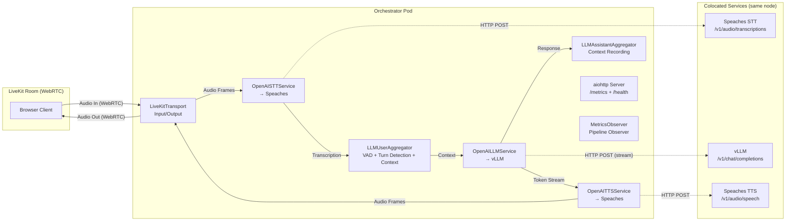

# Design Document: Pipecat Orchestrator Agent

## Overview

The Pipecat Orchestrator Agent is a Python voice agent that coordinates a real-time audio pipeline (VAD → STT → LLM → TTS) using the [Pipecat SDK](https://docs.pipecat.ai/). It connects to a LiveKit room for WebRTC audio transport, processes speech through Silero VAD, Speaches STT, vLLM, and Speaches TTS, supports barge-in interruption, and exposes per-stage Prometheus metrics.

The agent runs as a CPU-only container on EKS alongside colocated GPU services. It reads all configuration from environment variables (injected via Kubernetes ConfigMap) and provides a health endpoint for readiness probes.

### Key Design Decisions

1. **Pipecat's built-in OpenAI-compatible services** — Since Speaches and vLLM both expose OpenAI-compatible APIs, we use Pipecat's `OpenAISTTService`, `OpenAILLMService`, and `OpenAITTSService` with custom `base_url` pointing at the cluster-internal services. No custom HTTP client needed.

2. **SileroVADAnalyzer for turn detection** — Pipecat bundles Silero VAD as a core dependency. In Pipecat 1.0, the VAD analyzer is configured on the `LLMUserAggregatorParams` (not the transport). It runs in-process on CPU with configurable `stop_secs` (silence threshold), feeding segmented audio to the STT service.

3. **LiveKitTransport for WebRTC** — The `pipecat-ai[livekit]` plugin handles room connection, participant management, and bidirectional audio streaming. The agent joins as a bot participant.

4. **Separate metrics HTTP server** — A lightweight `aiohttp` server exposes `/metrics` and `/health` on a configurable port (default 8080), running alongside the Pipecat pipeline in the same asyncio event loop.

5. **Sentence-level TTS dispatch** — Pipecat's `OpenAITTSService` natively buffers LLM token output and dispatches TTS requests at sentence boundaries. We rely on this built-in behavior rather than implementing a custom aggregator.

6. **Universal LLMContext (Pipecat 1.0)** — We use the provider-agnostic `LLMContext` and `LLMContextAggregatorPair` instead of the deprecated `OpenAILLMContext`. This allows future LLM provider swaps without changing pipeline composition.

7. **Turn management via UserTurnStrategies** — Barge-in and interruption handling is configured through `LLMUserAggregatorParams` with `VADUserTurnStartStrategy`, replacing the deprecated `PipelineParams(allow_interruptions=True)`.

8. **Graceful shutdown on SIGTERM** — The agent handles SIGTERM to cleanly leave the LiveKit room before the Kubernetes termination grace period expires, preventing mid-utterance disconnects.

9. **Pipeline observers for metrics** — Rather than wrapping frame processors in context managers, we use Pipecat's pipeline observer pattern to hook into frame events and record stage durations. This avoids coupling metrics code to Pipecat's internal frame processing.

## Architecture



### Pipeline Flow

The Pipecat pipeline is a directed graph of frame processors. Frames flow downstream (left to right) through the pipeline:

1. **LiveKitTransport Input** — Receives raw audio frames from the WebRTC connection (16kHz, 16-bit PCM mono)
2. **SileroVADAnalyzer** — Configured on `LLMUserAggregatorParams`, detects speech start/end. On end-of-speech, commits the audio segment for processing
3. **OpenAISTTService** — Sends the audio segment to Speaches `/v1/audio/transcriptions`, returns transcription text
4. **LLMUserAggregator** — Maintains conversation history (system prompt + user/assistant turns), appends user transcription, manages turn detection and interruptions
5. **OpenAILLMService** — Streams chat completion from vLLM, emits `LLMTextFrame` tokens
6. **OpenAITTSService** — Buffers tokens into sentences (built-in), synthesizes each sentence via Speaches `/v1/audio/speech`
7. **LiveKitTransport Output** — Publishes synthesized audio frames back to the LiveKit room
8. **LLMAssistantAggregator** — Records assistant responses into the conversation context

### Barge-in Mechanism

In Pipecat 1.0, interruptions are managed through `UserTurnStrategies` configured on `LLMUserAggregatorParams`:
- When the user speaks while TTS audio is playing, the VAD fires a speech-start event via `VADUserTurnStartStrategy`
- The user aggregator emits an `InterruptionFrame` which propagates through the pipeline
- All downstream processors flush their queues (pending LLM tokens, queued TTS audio)
- The pipeline resets to accept the new user utterance

This replaces the deprecated `PipelineParams(allow_interruptions=True)` approach, which is silently ignored in Pipecat 1.0.

## Components and Interfaces

### Module: `config.py`

Responsible for loading and validating all environment variables at startup.

```python
from dataclasses import dataclass
from typing import Optional

@dataclass(frozen=True)
class Config:
    """Immutable configuration loaded from environment variables."""
    # LiveKit
    livekit_url: str
    livekit_api_key: str
    livekit_api_secret: str

    # Service endpoints
    stt_base_url: str
    tts_base_url: str
    llm_base_url: str

    # Model identifiers
    stt_model: str
    tts_model: str
    llm_model: str

    # VAD
    vad_silence_threshold_ms: int  # 100-2000, default 200

    # Metrics
    metrics_port: int  # 1-65535, default 8080

def load_config() -> Config:
    """
    Load configuration from environment variables.

    Raises:
        SystemExit: If required variables are missing or values are invalid.
    """
    ...
```

**Validation rules:**
- Required variables (exit on missing): `LIVEKIT_URL`, `LIVEKIT_API_KEY`, `LIVEKIT_API_SECRET`, `STT_BASE_URL`, `TTS_BASE_URL`, `LLM_BASE_URL`
- Required model variables (default to empty string if unset): `STT_MODEL`, `TTS_MODEL`, `LLM_MODEL`
- Ranged integers (exit on invalid): `VAD_SILENCE_THRESHOLD_MS` (100–2000, default 200), `METRICS_PORT` (1–65535, default 8080)

### Module: `metrics.py`

Prometheus instrumentation with per-stage histograms and a lightweight HTTP server.

```python
import time
from prometheus_client import Histogram, generate_latest, CONTENT_TYPE_LATEST
from aiohttp import web

# Histogram buckets tuned for voice latency
VOICE_LATENCY_BUCKETS = (0.05, 0.1, 0.15, 0.2, 0.3, 0.5, 0.8, 1.0, 1.5, 2.0)

stage_duration = Histogram(
    "voice_pipeline_stage_duration_seconds",
    "Per-stage processing duration",
    labelnames=["stage", "status"],
    buckets=VOICE_LATENCY_BUCKETS,
)

e2e_latency = Histogram(
    "voice_pipeline_e2e_latency_seconds",
    "End-to-end latency from VAD trigger to first TTS audio byte",
    buckets=VOICE_LATENCY_BUCKETS,
)

async def start_metrics_server(port: int) -> web.AppRunner:
    """Start aiohttp server exposing /metrics and /health."""
    app = web.Application()
    app.router.add_get("/metrics", handle_metrics)
    app.router.add_get("/health", handle_health)
    runner = web.AppRunner(app)
    await runner.setup()
    site = web.TCPSite(runner, "0.0.0.0", port)
    await site.start()
    return runner

async def handle_metrics(request: web.Request) -> web.Response:
    return web.Response(
        body=generate_latest(),
        content_type=CONTENT_TYPE_LATEST,
    )

async def handle_health(request: web.Request) -> web.Response:
    return web.json_response({"status": "ok"})
```

### Module: `observers.py`

Pipeline observer for recording per-stage latency metrics using Pipecat's observer pattern. This approach hooks into the frame flow without subclassing or wrapping individual processors.

```python
import time
import logging
from pipecat.pipeline.pipeline import Pipeline
from pipecat.frames.frames import (
    Frame,
    AudioRawFrame,
    TranscriptionFrame,
    TextFrame,
)
from metrics import stage_duration, e2e_latency

logger = logging.getLogger(__name__)


class MetricsObserver:
    """
    Pipeline observer that records per-stage and end-to-end latency.

    Hooks into on_push_frame events to timestamp frame transitions
    between processors and compute stage durations.
    """

    def __init__(self):
        self._turn_start_time: float | None = None
        self._stage_start_times: dict[str, float] = {}

    async def on_push_frame(
        self,
        src: str,
        dst: str,
        frame: Frame,
        direction: str,
    ):
        """Called by the pipeline when a frame is pushed between processors."""
        now = time.perf_counter()

        # Track VAD → STT transition (start of STT stage)
        if isinstance(frame, AudioRawFrame) and "stt" in dst.lower():
            self._stage_start_times["stt"] = now
            self._turn_start_time = now  # Start of E2E measurement

        # Track STT → LLM transition (end of STT, start of LLM)
        elif isinstance(frame, TranscriptionFrame):
            if "stt" in self._stage_start_times:
                elapsed = now - self._stage_start_times.pop("stt")
                stage_duration.labels(stage="stt", status="ok").observe(elapsed)
            self._stage_start_times["llm"] = now

        # Track LLM → TTS transition (end of LLM, start of TTS)
        elif isinstance(frame, TextFrame) and "tts" in dst.lower():
            if "llm" in self._stage_start_times:
                elapsed = now - self._stage_start_times.pop("llm")
                stage_duration.labels(stage="llm", status="ok").observe(elapsed)
            if "tts" not in self._stage_start_times:
                self._stage_start_times["tts"] = now

        # Track TTS → Transport output (end of TTS, E2E complete)
        elif isinstance(frame, AudioRawFrame) and "output" in dst.lower():
            if "tts" in self._stage_start_times:
                elapsed = now - self._stage_start_times.pop("tts")
                stage_duration.labels(stage="tts", status="ok").observe(elapsed)
            if self._turn_start_time is not None:
                e2e = now - self._turn_start_time
                e2e_latency.observe(e2e)
                self._turn_start_time = None
```

**Endpoints:**
- `GET /metrics` — Prometheus text exposition format
- `GET /health` — Returns 200 with `{"status": "ok"}` when the agent is ready

### Module: `token.py`

Generates LiveKit JWT access tokens for the bot participant.

```python
from livekit.api import AccessToken, VideoGrants

def generate_token(config) -> str:
    """
    Generate a LiveKit JWT token with publish/subscribe grants.

    The bot needs permission to:
    - Join the room
    - Subscribe to participant audio tracks (receive user audio)
    - Publish audio tracks (send TTS output)
    """
    token = AccessToken(
        api_key=config.livekit_api_key,
        api_secret=config.livekit_api_secret,
    )
    token.identity = "voice-agent"
    token.name = "Voice Agent"
    token.add_grant(VideoGrants(
        room_join=True,
        room="voice-agent-room",
        can_publish=True,
        can_subscribe=True,
    ))
    return token.to_jwt()
```

**Dependency:** `livekit-api>=0.7.0` (provides `AccessToken` and `VideoGrants`)

### Module: `agent.py`

Main entry point. Assembles the Pipecat pipeline and manages the agent lifecycle.

```python
import asyncio
import signal
import logging
from pipecat.pipeline.pipeline import Pipeline
from pipecat.pipeline.runner import PipelineRunner
from pipecat.pipeline.task import PipelineTask
from pipecat.services.openai.stt import OpenAISTTService
from pipecat.services.openai.llm import OpenAILLMService
from pipecat.services.openai.tts import OpenAITTSService
from pipecat.transports.livekit.transport import LiveKitTransport, LiveKitParams
from pipecat.audio.vad.silero import SileroVADAnalyzer
from pipecat.audio.vad.vad_analyzer import VADParams
from pipecat.processors.aggregators.llm_context import LLMContext
from pipecat.processors.aggregators.llm_response_universal import (
    LLMContextAggregatorPair,
    LLMUserAggregatorParams,
)
from pipecat.turns.user_start import VADUserTurnStartStrategy
from pipecat.turns.user_stop import SpeechTimeoutUserTurnStopStrategy
from pipecat.turns.user_turn_strategies import UserTurnStrategies

from config import load_config
from token import generate_token
from metrics import start_metrics_server
from observers import MetricsObserver

SYSTEM_PROMPT = """You are a helpful voice assistant. Keep your responses concise \
and conversational. Respond naturally as if speaking to someone."""

async def main():
    config = load_config()

    # Start metrics/health server
    metrics_runner = await start_metrics_server(config.metrics_port)

    # Configure transport (audio only, no VAD on transport in 1.0)
    transport = LiveKitTransport(
        url=config.livekit_url,
        token=generate_token(config),
        room_name="voice-agent-room",
        params=LiveKitParams(
            audio_in_enabled=True,
            audio_out_enabled=True,
        ),
    )

    # Configure services
    stt = OpenAISTTService(
        base_url=config.stt_base_url,
        api_key="sk-placeholder",  # Speaches doesn't require auth
        model=config.stt_model,
    )

    llm = OpenAILLMService(
        base_url=config.llm_base_url,
        api_key="sk-placeholder",  # vLLM doesn't require auth
        model=config.llm_model,
    )

    tts = OpenAITTSService(
        base_url=config.tts_base_url,
        api_key="sk-placeholder",  # Speaches doesn't require auth
        model=config.tts_model,
    )

    # Build universal context (Pipecat 1.0 — provider-agnostic)
    context = LLMContext(
        messages=[{"role": "system", "content": SYSTEM_PROMPT}]
    )

    # Configure turn management with VAD and interruption handling
    user_aggregator, assistant_aggregator = LLMContextAggregatorPair(
        context,
        user_params=LLMUserAggregatorParams(
            vad_analyzer=SileroVADAnalyzer(
                params=VADParams(
                    stop_secs=config.vad_silence_threshold_ms / 1000.0
                )
            ),
            user_turn_strategies=UserTurnStrategies(
                start=[VADUserTurnStartStrategy()],
                stop=[SpeechTimeoutUserTurnStopStrategy(
                    user_speech_timeout=config.vad_silence_threshold_ms / 1000.0
                )],
            ),
        ),
    )

    # Assemble pipeline
    pipeline = Pipeline([
        transport.input(),
        stt,
        user_aggregator,
        llm,
        tts,
        transport.output(),
        assistant_aggregator,
    ])

    # Create pipeline task with metrics observer
    task = PipelineTask(pipeline, observers=[MetricsObserver()])

    # Graceful shutdown on SIGTERM (Kubernetes pod termination)
    runner = PipelineRunner()

    def handle_shutdown(sig, frame):
        logging.info(f"Received {signal.Signals(sig).name}, shutting down...")
        asyncio.get_event_loop().create_task(task.cancel())

    signal.signal(signal.SIGTERM, handle_shutdown)
    signal.signal(signal.SIGINT, handle_shutdown)

    # Handle participant lifecycle
    @transport.event_handler("on_first_participant_joined")
    async def on_first_participant_joined(transport, participant_id):
        logging.info(f"Participant joined: {participant_id}")
        await task.queue_frames([LLMContext.create_context_frame(context)])

    @transport.event_handler("on_participant_left")
    async def on_participant_left(transport, participant_id, reason):
        logging.info(f"Participant left: {participant_id} ({reason})")
        await task.cancel()

    await runner.run(task)

    # Cleanup
    await metrics_runner.cleanup()

if __name__ == "__main__":
    logging.basicConfig(level=logging.INFO)
    asyncio.run(main())
```

### Pipecat Pipeline Composition

The pipeline is a linear sequence of frame processors. Key Pipecat 1.0 concepts:

| Concept | Role in Our Agent |
|---------|-------------------|
| `Pipeline` | Connects processors in order; routes frames downstream |
| `PipelineTask` | Wraps a pipeline; accepts observers for metrics |
| `PipelineRunner` | Event loop runner for the pipeline task |
| `LiveKitTransport` | Input (mic audio) + Output (speaker audio) via WebRTC |
| `SileroVADAnalyzer` | Configured on `LLMUserAggregatorParams`; detects speech boundaries |
| `OpenAISTTService` | Segmented STT via HTTP POST to `/v1/audio/transcriptions` |
| `OpenAILLMService` | Streaming chat completion via `/v1/chat/completions` |
| `OpenAITTSService` | HTTP streaming TTS via `/v1/audio/speech`; built-in sentence buffering |
| `LLMContextAggregatorPair` | Returns user + assistant aggregators; manages context, turns, and interruptions |
| `UserTurnStrategies` | Configures barge-in start/stop detection (replaces `allow_interruptions`) |

### Dockerfile

```dockerfile
FROM python:3.11-slim AS base

# Create non-root user
RUN groupadd -r agent && useradd -r -g agent -d /app -s /sbin/nologin agent

WORKDIR /app

# Install dependencies
COPY requirements.txt .
RUN pip install --no-cache-dir -r requirements.txt

# Copy application
COPY agent.py config.py metrics.py token.py observers.py ./

# Switch to non-root user
USER agent

EXPOSE 8080

# SIGTERM is forwarded to Python for graceful shutdown
STOPSIGNAL SIGTERM

ENTRYPOINT ["python", "agent.py"]
```

### Dependencies (`requirements.txt`)

```
pipecat-ai[livekit,silero,openai]>=1.0.0
livekit-api>=0.7.0
prometheus-client>=0.20.0
aiohttp>=3.9.0
```

## Data Models

### Configuration Schema

| Variable | Required | Type | Default | Range |
|----------|----------|------|---------|-------|
| `LIVEKIT_URL` | Yes | str | — | — |
| `LIVEKIT_API_KEY` | Yes | str | — | — |
| `LIVEKIT_API_SECRET` | Yes | str | — | — |
| `STT_BASE_URL` | Yes | str | — | — |
| `TTS_BASE_URL` | Yes | str | — | — |
| `LLM_BASE_URL` | Yes | str | — | — |
| `STT_MODEL` | No | str | `""` | — |
| `TTS_MODEL` | No | str | `""` | — |
| `LLM_MODEL` | No | str | `""` | — |
| `VAD_SILENCE_THRESHOLD_MS` | No | int | 200 | 100–2000 |
| `METRICS_PORT` | No | int | 8080 | 1–65535 |

### Prometheus Metrics Schema

| Metric | Type | Labels | Description |
|--------|------|--------|-------------|
| `voice_pipeline_stage_duration_seconds` | Histogram | `stage` (vad\|stt\|llm\|tts), `status` (ok\|error) | Wall-clock duration per pipeline stage |
| `voice_pipeline_e2e_latency_seconds` | Histogram | — | VAD trigger → first TTS audio byte |

**Histogram Buckets:** `[0.05, 0.1, 0.15, 0.2, 0.3, 0.5, 0.8, 1.0, 1.5, 2.0]`

### Conversation Context Model

```python
# Managed by Pipecat's universal LLMContext
messages: list[dict] = [
    {"role": "system", "content": "<system_prompt>"},
    {"role": "user", "content": "<transcription_1>"},
    {"role": "assistant", "content": "<response_1>"},
    # ... up to 20 messages (10 user-assistant pairs)
]
```

Context is managed by the `LLMContextAggregatorPair`. The user aggregator appends user transcriptions, and the assistant aggregator appends completed assistant responses. Context is trimmed by dropping the oldest user-assistant pairs when the history exceeds 20 messages, preserving the system prompt.

### Health Check Response

```json
{"status": "ok"}
```

Returned with HTTP 200 on `GET /health` once the pipeline is initialized and connected to LiveKit.


## Correctness Properties

*A property is a characteristic or behavior that should hold true across all valid executions of a system — essentially, a formal statement about what the system should do. Properties serve as the bridge between human-readable specifications and machine-verifiable correctness guarantees.*

### Property 1: Required variable validation

*For any* non-empty subset of required environment variables (`LIVEKIT_URL`, `LIVEKIT_API_KEY`, `LIVEKIT_API_SECRET`, `STT_BASE_URL`, `TTS_BASE_URL`, `LLM_BASE_URL`) that is absent or empty, `load_config()` shall raise a `SystemExit` and the error message shall name every missing variable.

**Validates: Requirements 1.6, 8.6**

### Property 2: Config range validation

*For any* integer value for `VAD_SILENCE_THRESHOLD_MS` within [100, 2000], `load_config()` shall accept it as the silence threshold. *For any* integer outside that range or any non-integer string, `load_config()` shall raise a `SystemExit`. The same holds for `METRICS_PORT` with range [1, 65535].

**Validates: Requirements 2.2, 8.4, 8.5, 8.7**

### Property 3: Exponential backoff timing

*For any* retry attempt number `n` in [1, 5], the delay before the nth retry shall be `2^(n-1)` seconds (i.e., 1s, 2s, 4s, 8s, 16s).

**Validates: Requirements 1.4**

### Property 4: Transcription filtering

*For any* string containing at least one non-whitespace character, the pipeline shall forward it to the LLM stage. *For any* string composed entirely of whitespace characters (including empty string), the pipeline shall discard it and not forward anything to the LLM stage.

**Validates: Requirements 3.3, 3.4**

### Property 5: Sentence boundary segmentation

*For any* stream of text tokens, the text forwarded to TTS shall be segmented into sentences split at sentence boundaries (`.`, `!`, or `?` followed by a space or end-of-stream), and each forwarded segment shall be a complete sentence.

**Validates: Requirements 4.3**

### Property 6: Context window invariant

*For any* sequence of conversation turns, the conversation context maintained by the orchestrator shall never exceed 20 messages (excluding the system prompt). When the limit is reached, the oldest user-assistant pair shall be dropped first.

**Validates: Requirements 4.4**

### Property 7: Stage duration measurement

*For any* pipeline stage execution (regardless of whether it succeeds or raises an exception), the `voice_pipeline_stage_duration_seconds` histogram shall record an observation with the elapsed wall-clock time, the correct `stage` label, and a `status` label of `"ok"` for successful executions or `"error"` for executions that raised an exception.

**Validates: Requirements 7.1, 7.5**

## Error Handling

### Startup Errors

| Condition | Behavior |
|-----------|----------|
| Required env var missing/empty | Log error naming each missing var, exit with code 1 |
| Ranged env var invalid | Log error with variable name and expected range, exit with code 1 |
| LiveKit connection fails | Retry with exponential backoff (1s, 2s, 4s, 8s, 16s), max 5 attempts |
| All retries exhausted | Log final failure, exit with code 1 |

### Runtime Errors

| Condition | Behavior |
|-----------|----------|
| STT service error/timeout (10s) | Log error, discard audio segment, resume listening |
| LLM service error mid-stream | Discard partial response, do not forward to TTS, resume listening |
| TTS service error/timeout (5s) | Skip affected sentence, continue with next sentence |
| LiveKit disconnect | Attempt reconnection via Pipecat's transport reconnect logic |
| SIGTERM received | Cancel pipeline task, leave LiveKit room, exit cleanly within 10s |
| Participant leaves room | Cancel pipeline task, cleanup, exit with code 0 |

### Error Propagation Strategy

Errors in individual pipeline stages do **not** crash the agent. The pipeline continues processing subsequent turns. Only startup configuration errors and exhausted connection retries cause process termination.

Pipecat's frame-based architecture naturally isolates errors: if a frame processor raises an exception, the error is logged and the frame is dropped. The pipeline continues accepting new frames from the transport.

### Metrics on Error

All stage executions — successful or failed — record their duration in the histogram with an appropriate `status` label. This ensures operators can observe both error rates and error latencies in Grafana.

## Testing Strategy

### Unit Tests

Focus on pure logic modules that don't require external services:

1. **`config.py` — Configuration validation**
   - Valid config loads correctly
   - Missing required variables → SystemExit with correct message
   - Invalid ranged values → SystemExit with correct message
   - Default values applied when optional vars unset

2. **`metrics.py` + `observers.py` — Metrics instrumentation**
   - `MetricsObserver` records correct stage durations and labels
   - Error paths record with `status="error"`
   - Histogram buckets match specification
   - `/health` returns 200 with correct body
   - `/metrics` returns valid Prometheus text format
   - E2E latency recorded correctly from VAD trigger to first TTS output

3. **Sentence segmentation logic**
   - Splits on `.`, `!`, `?` followed by space or EOS
   - Handles edge cases: abbreviations, ellipsis, consecutive punctuation
   - Empty input produces no output

4. **Transcription filtering**
   - Non-whitespace strings pass through
   - Whitespace-only strings are discarded
   - Empty strings are discarded

5. **Context window management**
   - Context grows up to 20 messages
   - Oldest pairs dropped on overflow
   - System prompt preserved

### Property-Based Tests

Property-based testing is applicable to this feature for the configuration validation, text processing, and metrics instrumentation logic. These are pure functions with clear input/output behavior and large input spaces.

**Library:** [Hypothesis](https://hypothesis.readthedocs.io/) (Python PBT standard)

**Configuration:**
- Minimum 100 iterations per property test
- Each test tagged with: `Feature: pipecat-orchestrator-agent, Property {N}: {title}`

**Properties to implement:**
- Property 1: Required variable validation
- Property 2: Config range validation
- Property 3: Exponential backoff timing
- Property 4: Transcription filtering
- Property 5: Sentence boundary segmentation
- Property 6: Context window invariant
- Property 7: Stage duration measurement

### Integration Tests

Test the assembled pipeline with mock services (using `aiohttp` test server or `pytest-httpserver`):

1. **Pipeline assembly** — Verify pipeline runs with mock STT/LLM/TTS
2. **Barge-in behavior** — Verify interruption cancels pending audio via `UserTurnStrategies`
3. **End-to-end flow** — Audio in → transcription → response → audio out
4. **Service timeout handling** — Mock slow services, verify graceful degradation
5. **Graceful shutdown** — Verify SIGTERM triggers clean room departure and pipeline cancellation
6. **Participant lifecycle** — Verify agent shuts down when participant leaves room

### Docker/Container Tests

1. **Image builds successfully** from Python 3.11-slim
2. **Non-root user** — Process runs as `agent` user
3. **Dependencies importable** — All required packages load
4. **Health endpoint** — `/health` responds after startup
5. **Missing env var** — Container exits within 5 seconds
6. **Image size** — Compressed size ≤ 500 MB
