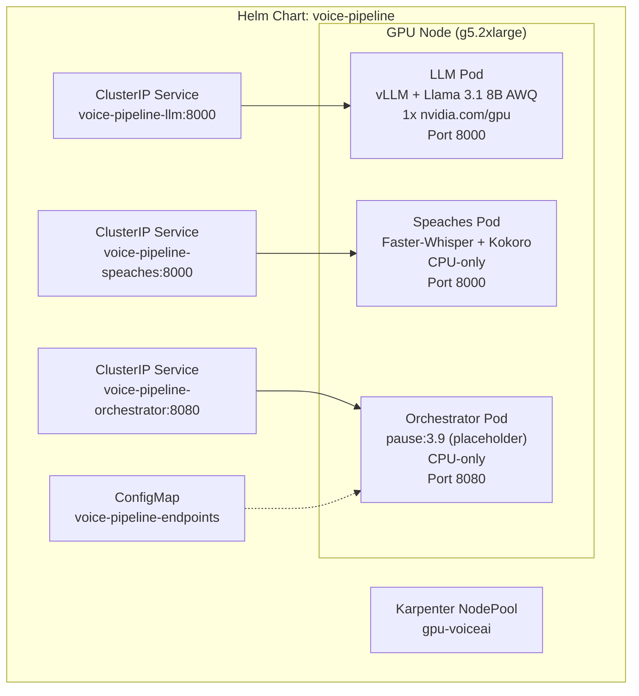

# Design Document: Voice Pipeline Helm Charts

## Overview

This design defines the Helm umbrella chart (`voice-pipeline/`) that deploys a complete Voice AI pipeline on a single EKS GPU node. The chart manages three application pods — LLM (vLLM on GPU), Speaches STT+TTS (CPU), and Orchestrator (placeholder) — with pod affinity rules ensuring colocation on the same `g5.2xlarge` node.

The chart supports two deployment modes (colocated and distributed) via values overrides, includes a Karpenter NodePool manifest for GPU node provisioning, and provides ClusterIP services with a ConfigMap for inter-pod service discovery.

### Design Decisions

1. **Single umbrella chart (not subcharts)** — All three deployments live as templates within one chart rather than as separate subcharts. This keeps the chart simple, avoids inter-chart dependency management, and matches the tightly-coupled nature of the pipeline components.

2. **LLM as scheduling anchor (asymmetric affinity)** — The LLM pod has NO pod affinity rules — it schedules freely on whatever GPU node Karpenter provisions. Speaches and Orchestrator pods use `podAffinity` targeting the LLM pod's component label (`app.kubernetes.io/component: llm`) to follow it onto the same node. This avoids the circular dependency deadlock that would occur if all pods required each other to already exist.

3. **ConfigMap-based service discovery** — The orchestrator reads endpoint URLs from a ConfigMap rather than hardcoding service names. This decouples the orchestrator image from the chart's service naming and supports future multi-namespace deployments.

4. **NodePool included in chart (not separate)** — The Karpenter NodePool manifest is packaged inside the chart so that `helm install` provisions both the workloads and the node provisioning rules in one command. Requires Karpenter (or EKS Auto Mode) to be pre-installed on the cluster.

5. **Pause container for orchestrator** — The orchestrator uses `registry.k8s.io/pause:3.9` as a placeholder. The real Pipecat agent image is delivered by Spec 3, keeping this chart independently deployable.

6. **Single AZ for demo simplicity** — The NodePool restricts to one AZ (`us-east-1a`) to guarantee pod colocation without cross-AZ scheduling complexity. For production, the NodePool should expand to multiple AZs and use topology spread constraints instead of single-AZ pinning.

## Architecture



### Deployment Flow

1. `helm install` creates the Karpenter NodePool (if not already present). **Prerequisite:** Karpenter (or EKS Auto Mode) must already be installed on the cluster.
2. Karpenter provisions a `g5.2xlarge` node with GPU taint and `workload-type: gpu-voiceai` label
3. LLM pod schedules on the GPU node (it's the only pod requesting `nvidia.com/gpu` and has NO affinity constraints — it acts as the scheduling anchor)
4. Speaches and Orchestrator pods schedule on the same node via `podAffinity` with `requiredDuringSchedulingIgnoredDuringExecution` targeting the LLM pod's label (`app.kubernetes.io/component: llm`)
5. Services and ConfigMap are created, enabling inter-pod communication via DNS

## Components and Interfaces

### Chart Structure

```
helm/voice-pipeline/
├── Chart.yaml                    # apiVersion: v2, name: voice-pipeline, version: 0.1.0
├── values.yaml                   # Default: colocated mode, g5.2xlarge
├── values-distributed.yaml       # Override: removes affinity, removes GPU tolerations from CPU pods
├── values-production.yaml        # Override: g5.12xlarge, NVIDIA NIM images
└── templates/
    ├── _helpers.tpl              # Shared helpers: labels, affinity, tolerations
    ├── namespace.yaml            # Optional namespace creation
    ├── llm-deployment.yaml       # vLLM Deployment
    ├── speaches-deployment.yaml  # Speaches Deployment
    ├── orchestrator-deployment.yaml  # Orchestrator Deployment
    ├── services.yaml             # All 3 ClusterIP services
    ├── configmap.yaml            # Endpoint URLs ConfigMap
    └── karpenter-nodepool.yaml   # Karpenter NodePool CR
```

### Template Helpers (`_helpers.tpl`)

The helpers template defines:

- **`voice-pipeline.labels`** — Standard Helm labels (`app.kubernetes.io/name`, `app.kubernetes.io/instance`, `helm.sh/chart`)
- **`voice-pipeline.pipelineLabels`** — Shared label `voice-pipeline/group: pipeline` applied to all pods (for identification/monitoring, NOT used as affinity selector)
- **`voice-pipeline.cpuPodAffinity`** — Pod affinity block using `requiredDuringSchedulingIgnoredDuringExecution` with `topologyKey: kubernetes.io/hostname` and label selector matching `app.kubernetes.io/component: llm`. Used ONLY by Speaches and Orchestrator deployments. The LLM pod has NO affinity — it is the scheduling anchor.
- **`voice-pipeline.gpuToleration`** — Conditional toleration for `nvidia.com/gpu=true:NoSchedule`. Renders the toleration when the component's `tolerateGpuTaint` value is `true`; renders empty when `false`.

When `scheduling.colocated` is `false` (distributed mode), the `cpuPodAffinity` helper renders an empty block.

### LLM Deployment

| Field | Value |
|-------|-------|
| Image | `public.ecr.aws/deep-learning-containers/vllm:server-cuda` |
| Model | `hugging-quants/Meta-Llama-3.1-8B-Instruct-AWQ-INT4` |
| GPU | 1x `nvidia.com/gpu` |
| CPU request | 2 cores |
| Memory request | 8Gi |
| Memory limit | 20Gi |
| Port | 8000 |
| Args | `--model`, `--gpu-memory-utilization 0.85`, `--max-model-len 4096`, `--host 0.0.0.0`, `--port 8000` |
| Startup Probe | HTTP GET `/health` port 8000, `periodSeconds: 10`, `failureThreshold: 30` (5 min budget) |
| Readiness Probe | HTTP GET `/health` port 8000, `periodSeconds: 10`, `failureThreshold: 3` |
| Liveness Probe | HTTP GET `/health` port 8000, `periodSeconds: 30`, `failureThreshold: 3` |
| Tolerations | `nvidia.com/gpu=true:NoSchedule` |
| Affinity | None — LLM is the scheduling anchor pod |

The startup probe gates both readiness and liveness. Once vLLM has loaded the model and the startup probe passes, normal probes kick in with shorter timeouts. This replaces the previous `initialDelaySeconds: 240` approach with the Kubernetes-idiomatic pattern for slow-starting containers.

Memory limit is set to 20Gi to cap vLLM's host memory usage (model weights + KV cache) and prevent node-level OOM. A `g5.2xlarge` has 32GB total; after kubelet overhead (~2GB), Speaches (4Gi limit), and Orchestrator (512Mi limit), ~25GB remains available. The 20Gi limit provides ample headroom while protecting the node.

### Speaches Deployment

| Field | Value |
|-------|-------|
| Image | `ghcr.io/speaches-ai/speaches:0.7.2` |
| GPU | None (CPU-only) |
| CPU request | 3 cores |
| Memory request | 2Gi |
| Port | 8000 |
| Environment Variables | `WHISPER__MODEL=Systran/faster-whisper-large-v3-turbo`, `WHISPER__INFERENCE_DEVICE=cpu`, `WHISPER__COMPUTE_TYPE=int8` |
| Readiness Probe | HTTP GET `/health` port 8000, `initialDelaySeconds: 60`, `periodSeconds: 10`, `failureThreshold: 3` |
| Liveness Probe | HTTP GET `/health` port 8000, `initialDelaySeconds: 120`, `periodSeconds: 30`, `failureThreshold: 5` |
| Tolerations | `nvidia.com/gpu=true:NoSchedule` (conditional on `tolerateGpuTaint: true`) |
| Affinity | `podAffinity` targeting `app.kubernetes.io/component: llm` on same node |

Note: The image tag is pinned to a specific release for reproducibility. Check [speaches-ai/speaches releases](https://github.com/speaches-ai/speaches/releases) for updates.

Speaches uses double-underscore notation for nested configuration ([Speaches docs](https://speaches.ai/configuration/)). The TTS engine (Kokoro) is available by default — the model is specified at request time via the API's `model` parameter (e.g., `speaches-ai/Kokoro-82M-v1.0`).

### Orchestrator Deployment

| Field | Value |
|-------|-------|
| Image | `registry.k8s.io/pause:3.9` |
| GPU | None (CPU-only) |
| CPU request | 1 core |
| Memory request | 256Mi |
| Port | 8080 |
| Env From | ConfigMap `voice-pipeline-endpoints` |
| Readiness Probe | TCP socket port 8080, `initialDelaySeconds: 5`, `periodSeconds: 10` |
| Tolerations | `nvidia.com/gpu=true:NoSchedule` (conditional on `tolerateGpuTaint: true`) |
| Affinity | `podAffinity` targeting `app.kubernetes.io/component: llm` on same node |

Note: The pause container listens on no port, so the TCP probe will fail until the real Pipecat image replaces it (Spec 3). This is expected for the placeholder — the pod will be in `NotReady` state.

### ClusterIP Services

| Service Name | Target Port | Selector |
|---|---|---|
| `voice-pipeline-llm` | 8000 | `app.kubernetes.io/component: llm` |
| `voice-pipeline-speaches` | 8000 | `app.kubernetes.io/component: speaches` |
| `voice-pipeline-orchestrator` | 8080 | `app.kubernetes.io/component: orchestrator` |

### Endpoint ConfigMap

```yaml
apiVersion: v1
kind: ConfigMap
metadata:
  name: voice-pipeline-endpoints
data:
  {{- if .Values.stt.enabled }}
  STT_BASE_URL: "http://voice-pipeline-stt.{{ .Release.Namespace }}.svc.cluster.local:{{ .Values.stt.port }}"
  {{- else }}
  STT_BASE_URL: "http://voice-pipeline-speaches.{{ .Release.Namespace }}.svc.cluster.local:{{ .Values.speaches.port }}"
  {{- end }}
  {{- if .Values.tts.enabled }}
  TTS_BASE_URL: "http://voice-pipeline-tts.{{ .Release.Namespace }}.svc.cluster.local:{{ .Values.tts.port }}"
  {{- else }}
  TTS_BASE_URL: "http://voice-pipeline-speaches.{{ .Release.Namespace }}.svc.cluster.local:{{ .Values.speaches.port }}"
  {{- end }}
  LLM_BASE_URL: "http://voice-pipeline-llm.{{ .Release.Namespace }}.svc.cluster.local:8000"
  LLM_MODEL: "{{ .Values.llm.model }}"
  STT_MODEL: "{{ .Values.speaches.env.WHISPER__MODEL | default .Values.stt.model }}"
  TTS_MODEL: "{{ .Values.orchestrator.ttsModel | default "speaches-ai/Kokoro-82M-v1.0" }}"
```

The ConfigMap conditionally routes STT/TTS URLs to separate NIM pods in production mode or to the unified Speaches pod in demo mode.

### Karpenter NodePool

Matches the existing `k8s/gpu-nodepool.yaml` in the repo:

- Instance types: `g5.2xlarge`, `g5.4xlarge`
- Capacity type: On-Demand
- Taint: `nvidia.com/gpu=true:NoSchedule`
- Label: `workload-type: gpu-voiceai`
- AZ: `us-east-1a` (single AZ for colocation guarantee — see Design Decision #6)
- GPU limit: 2 `nvidia.com/gpu`
- Consolidation: `WhenEmpty` after 30 minutes
- Disruption budgets: `nodes: "0"` (prevents voluntary disruption of nodes running pipeline workloads)
- NodeClass ref: `group: eks.amazonaws.com`, `kind: NodeClass`, `name: default` (EKS Auto Mode)

## Data Models

### values.yaml (Default — Colocated Mode)

```yaml
# Scheduling
scheduling:
  colocated: true
  nodeSelector: {}

# Shared pipeline label (for identification/monitoring, NOT used as affinity selector)
pipeline:
  group: pipeline

# GPU toleration applied to all pods in colocated mode
gpu:
  taint:
    key: nvidia.com/gpu
    value: "true"
    effect: NoSchedule

# LLM configuration (scheduling anchor — no affinity rules)
llm:
  image:
    repository: public.ecr.aws/deep-learning-containers/vllm
    tag: server-cuda
  model: hugging-quants/Meta-Llama-3.1-8B-Instruct-AWQ-INT4
  args:
    gpuMemoryUtilization: "0.85"
    maxModelLen: "4096"
  resources:
    requests:
      cpu: "2"
      memory: 8Gi
      nvidia.com/gpu: "1"
    limits:
      memory: 20Gi
      nvidia.com/gpu: "1"
  startupProbe:
    periodSeconds: 10
    failureThreshold: 30  # 5 minutes total budget for model loading
  readinessProbe:
    periodSeconds: 10
    failureThreshold: 3
  livenessProbe:
    periodSeconds: 30
    failureThreshold: 3
  port: 8000

# Speaches STT+TTS configuration
speaches:
  enabled: true
  tolerateGpuTaint: true  # Set false in distributed mode
  image:
    repository: ghcr.io/speaches-ai/speaches
    tag: "0.7.2"  # Pin to specific version; check https://github.com/speaches-ai/speaches/releases
  env:
    WHISPER__MODEL: Systran/faster-whisper-large-v3-turbo
    WHISPER__INFERENCE_DEVICE: cpu
    WHISPER__COMPUTE_TYPE: int8
  resources:
    requests:
      cpu: "3"
      memory: 2Gi
    limits:
      cpu: "4"
      memory: 4Gi
  readinessProbe:
    initialDelaySeconds: 60
    periodSeconds: 10
    failureThreshold: 3
  livenessProbe:
    initialDelaySeconds: 120
    periodSeconds: 30
    failureThreshold: 5
  port: 8000

# Orchestrator configuration
orchestrator:
  tolerateGpuTaint: true  # Set false in distributed mode
  image:
    repository: registry.k8s.io/pause
    tag: "3.9"
  resources:
    requests:
      cpu: "1"
      memory: 256Mi
    limits:
      cpu: "2"
      memory: 512Mi
  port: 8080
  ttsModel: "speaches-ai/Kokoro-82M-v1.0"

# Production mode: separate STT/TTS pods (disabled by default)
stt:
  enabled: false
  port: 8000

tts:
  enabled: false
  port: 8000

# Karpenter NodePool
nodepool:
  enabled: true
  instanceTypes:
    - g5.2xlarge
    - g5.4xlarge
  capacityType: on-demand
  availabilityZone: us-east-1a
  gpuLimit: 2
  nodeClassRef:
    group: eks.amazonaws.com    # EKS Auto Mode; use karpenter.k8s.aws for standalone Karpenter
    kind: NodeClass
    name: default
  disruption:
    consolidateAfter: 30m
    consolidationPolicy: WhenEmpty
    budgets:
      - nodes: "0"  # Prevents Karpenter from disrupting nodes with active pipeline workloads
```

### values-distributed.yaml

```yaml
# Disable pod affinity — pods schedule freely across nodes
scheduling:
  colocated: false

# Remove GPU toleration from CPU-only pods
speaches:
  tolerateGpuTaint: false

orchestrator:
  tolerateGpuTaint: false
```

### values-production.yaml

```yaml
# Target g5.12xlarge (4x A10G)
nodepool:
  instanceTypes:
    - g5.12xlarge
  gpuLimit: 8

# LLM keeps the same image but gets more resources
llm:
  resources:
    requests:
      cpu: "4"
      memory: 16Gi
      nvidia.com/gpu: "1"
    limits:
      nvidia.com/gpu: "1"

# Replace Speaches with NVIDIA NIM STT
stt:
  enabled: true
  image:
    repository: nvcr.io/nim/nvidia/parakeet-ctc-0.6b-asr
    tag: latest
  resources:
    requests:
      nvidia.com/gpu: "1"

# Replace Speaches TTS with NVIDIA NIM TTS
tts:
  enabled: true
  image:
    repository: nvcr.io/nim/nvidia/magpie-tts-multilingual
    tag: latest
  resources:
    requests:
      nvidia.com/gpu: "1"

# Disable unified Speaches pod in production mode
speaches:
  enabled: false
```

## Correctness Properties

*A property is a characteristic or behavior that should hold true across all valid executions of a system — essentially, a formal statement about what the system should do. Properties serve as the bridge between human-readable specifications and machine-verifiable correctness guarantees.*

This feature consists of Helm chart templates — declarative Kubernetes configuration — not pure functions with input/output behavior. Property-based testing has limited applicability because Helm templates are deterministic (same values → same YAML) and the input space is a fixed schema rather than arbitrary data. However, the following template-rendering invariant can be validated:

### Property 1: Colocated mode affinity consistency

*For any* valid values.yaml with `scheduling.colocated: true`, the Speaches and Orchestrator Deployment manifests SHALL contain identical `podAffinity` blocks with `requiredDuringSchedulingIgnoredDuringExecution` using `topologyKey: kubernetes.io/hostname` and a label selector matching `app.kubernetes.io/component: llm`. The LLM Deployment SHALL NOT contain any `podAffinity` block (it is the scheduling anchor).

**Validates: Requirements 5.1, 5.2, 5.4**

### Property 2: Distributed mode removes all affinity constraints

*For any* valid values.yaml with `scheduling.colocated: false`, none of the rendered Deployment manifests (LLM, Speaches, Orchestrator) SHALL contain a `podAffinity` block.

**Validates: Requirements 7.1, 7.2**

### Property 3: GPU resource exclusivity

*For any* rendered set of Deployment manifests, exactly one Deployment (LLM) SHALL request `nvidia.com/gpu` resources, and the remaining Deployments (Speaches, Orchestrator) SHALL NOT request any GPU resources.

**Validates: Requirements 2.2, 3.1, 4.1**

### Property 4: ConfigMap URL format consistency

*For any* namespace value, all endpoint URLs in the rendered ConfigMap SHALL follow the format `http://<service-name>.<namespace>.svc.cluster.local:<port>`.

**Validates: Requirements 6.2, 6.4**

## Error Handling

### Pod Scheduling Failures

- **No GPU node available**: Karpenter provisions a new `g5.2xlarge` node. If capacity is unavailable, pods remain `Pending` with event messages indicating the capacity constraint.
- **Affinity unsatisfiable**: CPU pods (Speaches, Orchestrator) wait in `Pending` state until the LLM pod is scheduled and running on a node. The LLM pod is the anchor — it has no affinity constraints and schedules freely on any GPU node. Once the LLM pod exists, the CPU pods' affinity targeting `app.kubernetes.io/component: llm` is satisfiable.
- **Node taint mismatch**: All pipeline pods include GPU taint tolerations in colocated mode (controlled by `tolerateGpuTaint` value). If a toleration is missing, the pod stays `Pending` with a taint-related event.

### Container Startup Failures

- **Model download failure (LLM)**: The vLLM container will fail to start if the Hugging Face model is unreachable. The startup probe allows up to 5 minutes (30 failures × 10s) for model loading. If the startup probe never passes, Kubernetes restarts the container. Once the startup probe passes, the liveness probe detects hangs within 90s (30s × 3 failures) and triggers a restart.
- **Model download failure (Speaches)**: Faster-Whisper models download on first request. The readiness probe's 60s initial delay handles container startup; model download happens asynchronously.
- **OOM kills**: Memory limits are set above requests to allow burst usage. If a container exceeds its limit, Kubernetes OOM-kills it and the Deployment controller restarts it.

### Service Discovery Failures

- **Pod not ready**: Kubernetes automatically removes pods from Service endpoints when readiness probes fail. The orchestrator receives connection errors until the target pod passes its readiness check.
- **DNS resolution failure**: Endpoint ConfigMap uses fully-qualified DNS names (`svc.cluster.local`) to avoid search path ambiguity.

### Distributed Mode Transition

- **Rolling update during mode switch**: `helm upgrade -f values-distributed.yaml` triggers a rolling update. During transition, some pods may temporarily be on the old node while new ones schedule on different nodes. The `maxSurge`/`maxUnavailable` strategy handles this gracefully.

## Testing Strategy

### Why Property-Based Testing Does Not Apply

This feature consists of Helm chart templates — declarative Kubernetes configuration rendered from Go templates. There are no pure functions, no input/output transformations amenable to randomized testing, and no universal properties that hold across varied inputs. The "inputs" are values files with a fixed schema, and the "outputs" are deterministic YAML manifests.

### Appropriate Testing Approaches

**1. Helm Template Rendering Tests (Unit)**

Validate that `helm template` produces correct manifests for each values combination:

- Default values → 3 Deployments, 3 Services, 1 ConfigMap, 1 NodePool, affinity on CPU pods only (LLM has none)
- `values-distributed.yaml` → Same resources but no affinity blocks on any pod, no GPU tolerations on CPU pods
- `values-production.yaml` → Different images, GPU requests on STT/TTS pods, Speaches disabled, separate STT/TTS services

Tool: `helm template` + `yq` assertions or the [helm-unittest](https://github.com/helm-unittest/helm-unittest) plugin.

**2. Schema Validation Tests**

- Rendered manifests pass `kubectl apply --dry-run=client`
- Rendered manifests pass `kubeconform` or `kubeval` against the target Kubernetes version schema
- Karpenter NodePool validates against the `karpenter.sh/v1` CRD schema

**3. Integration Tests (Cluster-Level)**

- `helm install` completes successfully on a live EKS cluster
- All 3 pods schedule on the same node (verify `kubectl get pods -o wide`)
- LLM pod readiness probe passes within 5 minutes
- Speaches pod readiness probe passes within 3 minutes
- Services resolve via DNS from within the cluster
- Mode toggle via `helm upgrade -f values-distributed.yaml` reschedules pods to different nodes

**4. Specific Example Tests**

- LLM responds to `POST /v1/chat/completions` with a streamed response
- Speaches responds to `POST /v1/audio/transcriptions` with a transcription
- Speaches responds to `POST /v1/audio/speech` with audio data
- ConfigMap contains correct fully-qualified service URLs

**5. Edge Case Tests**

- Chart renders without error when `nodepool.enabled: false`
- Chart handles namespace override correctly in ConfigMap URLs
- Distributed mode correctly omits affinity from all 3 deployments
- GPU resource request is present only on the LLM pod (not Speaches or Orchestrator)
- LLM pod has NO affinity block in any mode (anchor pod)
- ConfigMap routes STT/TTS URLs correctly when `stt.enabled: true` / `tts.enabled: true` (production mode)
- NodePool template renders `disruption.budgets` block correctly
